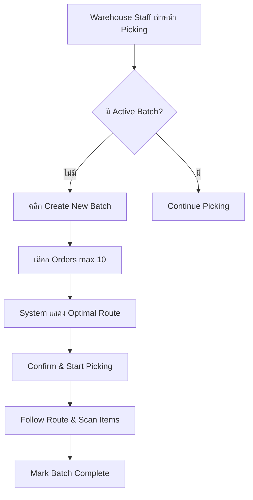

# 📋 Development Context Template

> **คู่มือการสร้าง Context สำหรับการพัฒนาด้วย AI**
> ใช้เทมเพลตนี้เพื่อสร้าง Context ที่ชัดเจนและครบถ้วนสำหรับการพัฒนาฟีเจอร์ใหม่

---

## 🎯 1. วัตถุประสงค์ของโค้ด (Objective)

### 1.1 เป้าหมายหลัก (Main Goal)
- [ ] อธิบายว่าฟีเจอร์นี้ทำอะไร และแก้ปัญหาอะไร
- [ ] ระบุผู้ใช้งานหลัก (Target Users)
- [ ] ระบุผลลัพธ์ที่คาดหวัง (Expected Outcomes)

**ตัวอย่าง:**
```markdown
**เป้าหมาย:** สร้างระบบจัดการ Picking List แบบ Batch Picking
**ผู้ใช้:** พนักงานคลังสินค้า (Warehouse Staff)
**ผลลัพธ์:**
- ลดเวลาในการเก็บสินค้าลง 40%
- รวม Order หลายรายการในการ Pick ครั้งเดียว
- แสดงเส้นทางที่เหมาะสมในการเก็บสินค้า
```

### 1.2 ปัญหาที่แก้ไข (Problem Statement)
- [ ] อธิบายปัญหาปัจจุบันอย่างชัดเจน
- [ ] ระบุผลกระทบของปัญหา (Impact)
- [ ] แนบข้อมูลหรือสถิติประกอบ (ถ้ามี)

**ตัวอย่าง:**
```markdown
**ปัญหา:** ปัจจุบันพนักงานต้อง Pick สินค้าทีละ Order ทำให้:
- ใช้เวลาเดินในคลังมาก (เฉลี่ย 2 ชม/วัน)
- เก็บสินค้าซ้ำจาก Location เดียวกันหลายครั้ง
- ไม่มีการวางแผนเส้นทางที่เหมาะสม

**ข้อมูลสนับสนุน:**
- เฉลี่ย 120 Orders/วัน
- 60% ของ Orders มีสินค้าที่อยู่ Location ใกล้กัน
- พนักงาน 5 คน ใช้เวลา Pick รวม 30 ชม/วัน
```

### 1.3 ขอบเขตของงาน (Scope)
- [ ] ระบุสิ่งที่จะทำ (In Scope)
- [ ] ระบุสิ่งที่ไม่ทำ (Out of Scope)
- [ ] กำหนดขอบเขตเวอร์ชันแรก (MVP)

**ตัวอย่าง:**
```markdown
**✅ In Scope:**
- Batch Picking สูงสุด 10 Orders/Batch
- แสดงเส้นทาง Optimal Path
- รองรับ Mobile และ Desktop
- Export PickList เป็น PDF

**❌ Out of Scope:**
- Voice Picking Integration
- Barcode Scanning (Phase 2)
- Real-time Location Tracking
```

---

## 🧩 2. การออกแบบ (Design Plan)

### 2.1 Database Schema
- [ ] ระบุตารางที่เกี่ยวข้อง
- [ ] ออกแบบตารางใหม่ (ถ้าจำเป็น)
- [ ] กำหนด Relationships และ Foreign Keys
- [ ] วางแผน Indexes สำหรับ Performance

**ตัวอย่าง:**
```sql
-- ตารางใหม่: wms_batch_picklists
CREATE TABLE wms_batch_picklists (
  batch_id UUID PRIMARY KEY DEFAULT uuid_generate_v4(),
  batch_no VARCHAR(50) UNIQUE NOT NULL,
  status VARCHAR(20) DEFAULT 'pending', -- pending, in_progress, completed
  picker_id UUID REFERENCES master_employee(employee_id),
  total_orders INT NOT NULL,
  total_items INT NOT NULL,
  optimal_route JSONB, -- เก็บลำดับ locations
  created_at TIMESTAMP DEFAULT NOW(),
  started_at TIMESTAMP,
  completed_at TIMESTAMP
);

-- ตารางเชื่อม: wms_batch_picklist_orders
CREATE TABLE wms_batch_picklist_orders (
  id UUID PRIMARY KEY DEFAULT uuid_generate_v4(),
  batch_id UUID REFERENCES wms_batch_picklists(batch_id),
  order_id UUID REFERENCES wms_orders(order_id),
  sequence INT NOT NULL -- ลำดับการ Pick
);

-- Indexes สำหรับ Performance
CREATE INDEX idx_batch_status ON wms_batch_picklists(status);
CREATE INDEX idx_batch_picker ON wms_batch_picklists(picker_id);
CREATE INDEX idx_batch_created ON wms_batch_picklists(created_at);
```

**ตารางที่เกี่ยวข้อง:**
```markdown
1. `wms_orders` - ดึงข้อมูล Orders ที่จะ Pick
2. `wms_order_items` - รายการสินค้าในแต่ละ Order
3. `wms_inventory` - ตรวจสอบสต็อกและ Location
4. `master_warehouse_location` - ข้อมูลตำแหน่งสินค้า
5. `master_employee` - ข้อมูลพนักงาน Picker
```

### 2.2 API Design
- [ ] กำหนด Endpoints และ Methods
- [ ] ออกแบบ Request/Response Structure
- [ ] กำหนด Error Handling
- [ ] วางแผน Authentication & Authorization

**ตัวอย่าง:**
```typescript
// POST /api/batch-picklists/create
interface CreateBatchPicklistRequest {
  order_ids: string[];        // สูงสุด 10 Orders
  picker_id?: string;         // Optional: assign picker
  optimize_route?: boolean;   // Default: true
}

interface CreateBatchPicklistResponse {
  success: boolean;
  data: {
    batch_id: string;
    batch_no: string;
    total_orders: number;
    total_items: number;
    optimal_route: Array<{
      location_id: string;
      location_code: string;
      items: Array<{
        order_no: string;
        sku_code: string;
        quantity: number;
      }>;
    }>;
    estimated_time_minutes: number;
  };
  error?: string;
}

// GET /api/batch-picklists/:batch_id
// PUT /api/batch-picklists/:batch_id/start
// PUT /api/batch-picklists/:batch_id/complete
// GET /api/batch-picklists/active (รายการที่กำลัง Pick)
```

**Error Handling:**
```typescript
enum BatchPicklistError {
  ORDERS_LIMIT_EXCEEDED = 'MAX_10_ORDERS',
  INSUFFICIENT_STOCK = 'STOCK_NOT_AVAILABLE',
  INVALID_ORDER_STATUS = 'ORDER_NOT_READY',
  PICKER_ALREADY_ASSIGNED = 'PICKER_HAS_ACTIVE_BATCH'
}
```

### 2.3 UI/UX Design
- [ ] สร้าง Wireframes หรือ Mockups
- [ ] กำหนด User Flow
- [ ] ระบุ Components ที่ใช้จาก Design System
- [ ] วางแผน Responsive Design

**ตัวอย่าง:**
```markdown
**หน้าจอหลัก: Batch Picklist Creation**

┌─────────────────────────────────────────┐
│  🎯 สร้าง Batch Picklist                │
├─────────────────────────────────────────┤
│                                          │
│  [Search Orders] 🔍                      │
│                                          │
│  📋 Selected Orders (3/10)               │
│  ┌────────────────────────────────────┐ │
│  │ ✓ ORD-0001 | 5 items | Zone A    │ │
│  │ ✓ ORD-0002 | 3 items | Zone A,B  │ │
│  │ ✓ ORD-0003 | 8 items | Zone B    │ │
│  └────────────────────────────────────┘ │
│                                          │
│  👤 Assign Picker: [Dropdown]            │
│  ✅ Optimize Route                       │
│                                          │
│  [Cancel]  [Create Batch Picklist] →    │
└─────────────────────────────────────────┘

**Components ใช้:**
- `<Card>` - Container หลัก
- `<Button>` size="lg" variant="primary"
- `<Table>` - แสดงรายการ Orders
- `<Badge>` - แสดง Status
- `<SearchInput>` - ค้นหา Orders
- `<Select>` - เลือก Picker
```

**User Flow:**


### 2.4 Business Logic
- [ ] อธิบาย Algorithm หลัก
- [ ] กำหนด Validation Rules
- [ ] ระบุ Edge Cases
- [ ] วางแผน Performance Optimization

**ตัวอย่าง:**
```typescript
/**
 * Algorithm: Nearest Neighbor Route Optimization
 *
 * เริ่มจาก Location ที่ใกล้ Packing Area มากที่สุด
 * หา Location ถัดไปที่ใกล้ที่สุดและยังไม่ได้เข้า
 * จนครบทุก Locations
 */

function optimizePickingRoute(items: PickItem[]): OptimizedRoute {
  // 1. Group items โดย Location
  const locationMap = groupByLocation(items);

  // 2. Calculate distances ระหว่าง Locations
  const distances = calculateDistances(locationMap);

  // 3. Apply Nearest Neighbor Algorithm
  const route = nearestNeighbor(distances, START_LOCATION);

  // 4. Return optimized sequence
  return {
    sequence: route,
    total_distance: calculateTotalDistance(route),
    estimated_time: estimateTime(route)
  };
}

/**
 * Validation Rules:
 */
const BATCH_RULES = {
  MAX_ORDERS: 10,
  MAX_ITEMS: 50,
  MAX_WEIGHT_KG: 30,
  SAME_WAREHOUSE_ONLY: true,
  REQUIRE_STOCK_AVAILABLE: true
};

/**
 * Edge Cases:
 */
// 1. สินค้าหมดระหว่างสร้าง Batch
// 2. Location เดียวกันมีหลาย Orders
// 3. Picker ลาออกระหว่าง Pick
// 4. Order ถูกยกเลิกระหว่าง Pick
```

---

## ⚙️ 3. การพัฒนา (Implementation Plan)

### 3.1 Task Breakdown
- [ ] แบ่งงานเป็น Tasks ย่อย
- [ ] กำหนดลำดับความสำคัญ
- [ ] ประมาณเวลาแต่ละ Task
- [ ] ระบุ Dependencies

**ตัวอย่าง:**
```markdown
### Phase 1: Database & API (3-4 ชั่วโมง)
- [ ] สร้างตาราง `wms_batch_picklists` และ migrations (30 นาที)
- [ ] สร้างตาราง `wms_batch_picklist_orders` (15 นาที)
- [ ] สร้าง API Route `/api/batch-picklists/create` (1 ชั่วโมง)
- [ ] Implement Route Optimization Algorithm (1.5 ชั่วโมง)
- [ ] สร้าง API Routes อื่นๆ (GET, PUT) (45 นาที)

### Phase 2: UI Components (2-3 ชั่วโมง)
- [ ] สร้างหน้า Batch Picklist Creation (1 ชั่วโมง)
- [ ] สร้าง Order Selection Component (45 นาที)
- [ ] สร้างหน้า Active Picklist View (1 ชั่วโมง)
- [ ] สร้างหน้า Route Display (30 นาที)

### Phase 3: Integration & Testing (2 ชั่วโมง)
- [ ] เชื่อม Frontend กับ API (45 นาที)
- [ ] Integration Testing (45 นาที)
- [ ] Bug Fixes และ Refinement (30 นาที)

**รวมเวลา:** 7-9 ชั่วโมง
```

### 3.2 Code Structure
- [ ] กำหนดโครงสร้าง Folders และ Files
- [ ] ระบุ Naming Conventions
- [ ] วางแผน Code Reusability

**ตัวอย่าง:**
```
app/
├── warehouse/
│   └── picking/
│       ├── page.tsx                    # หน้ารายการ Picklists
│       ├── create/
│       │   └── page.tsx               # หน้าสร้าง Batch
│       └── [batch_id]/
│           └── page.tsx               # หน้ารายละเอียด Batch

app/api/
└── batch-picklists/
    ├── route.ts                       # GET all, POST create
    ├── [batch_id]/
    │   ├── route.ts                   # GET one, DELETE
    │   ├── start/
    │   │   └── route.ts              # PUT start picking
    │   └── complete/
    │       └── route.ts              # PUT complete
    └── active/
        └── route.ts                   # GET active batches

lib/
├── services/
│   └── batch-picklist-service.ts     # Business Logic
├── utils/
│   └── route-optimizer.ts            # Algorithm
└── types/
    └── batch-picklist.ts             # TypeScript Types

components/
└── batch-picklist/
    ├── BatchPicklistCard.tsx
    ├── OrderSelector.tsx
    ├── RouteDisplay.tsx
    └── PickerAssignment.tsx
```

### 3.3 Implementation Details
- [ ] ระบุ Libraries และ Dependencies
- [ ] แนบ Code Snippets สำคัญ
- [ ] อธิบาย Complex Logic

**ตัวอย่าง:**

**Dependencies:**
```json
{
  "dependencies": {
    "@turf/turf": "^7.0.0",        // Geospatial calculations
    "react-hook-form": "^7.51.0",  // Form handling
    "zod": "^3.22.4"               // Validation
  }
}
```

**Key Code: Route Optimization**
```typescript
// lib/utils/route-optimizer.ts
import { distance } from '@turf/turf';

interface Location {
  location_id: string;
  location_code: string;
  coordinates: [number, number]; // [lng, lat]
  items: PickItem[];
}

export class RouteOptimizer {
  /**
   * Nearest Neighbor Algorithm
   * Time Complexity: O(n²)
   */
  static optimize(locations: Location[]): Location[] {
    if (locations.length <= 1) return locations;

    const visited = new Set<string>();
    const route: Location[] = [];

    // เริ่มจาก Packing Area (0,0)
    let current: [number, number] = [0, 0];

    while (route.length < locations.length) {
      let nearest: Location | null = null;
      let minDistance = Infinity;

      // หา Location ที่ใกล้ที่สุดที่ยังไม่ได้เข้า
      for (const loc of locations) {
        if (visited.has(loc.location_id)) continue;

        const dist = distance(
          { type: 'Point', coordinates: current },
          { type: 'Point', coordinates: loc.coordinates }
        );

        if (dist < minDistance) {
          minDistance = dist;
          nearest = loc;
        }
      }

      if (nearest) {
        route.push(nearest);
        visited.add(nearest.location_id);
        current = nearest.coordinates;
      }
    }

    return route;
  }

  /**
   * คำนวณระยะทางรวม
   */
  static calculateTotalDistance(route: Location[]): number {
    let total = 0;
    let prev: [number, number] = [0, 0];

    for (const loc of route) {
      total += distance(
        { type: 'Point', coordinates: prev },
        { type: 'Point', coordinates: loc.coordinates }
      );
      prev = loc.coordinates;
    }

    return total;
  }
}
```

**Key Code: API Route Handler**
```typescript
// app/api/batch-picklists/route.ts
import { createRouteHandlerClient } from '@supabase/auth-helpers-nextjs';
import { NextRequest, NextResponse } from 'next/server';
import { z } from 'zod';

const CreateBatchSchema = z.object({
  order_ids: z.array(z.string().uuid()).min(1).max(10),
  picker_id: z.string().uuid().optional(),
  optimize_route: z.boolean().default(true)
});

export async function POST(request: NextRequest) {
  try {
    const supabase = createRouteHandlerClient({ cookies });
    const body = await request.json();

    // Validate input
    const validated = CreateBatchSchema.parse(body);

    // Check stock availability
    const stockCheck = await checkStockAvailability(
      supabase,
      validated.order_ids
    );

    if (!stockCheck.success) {
      return NextResponse.json(
        { error: 'INSUFFICIENT_STOCK', details: stockCheck.errors },
        { status: 400 }
      );
    }

    // Fetch order items with locations
    const items = await fetchOrderItems(supabase, validated.order_ids);

    // Optimize route
    const route = validated.optimize_route
      ? RouteOptimizer.optimize(items)
      : items;

    // Create batch record
    const { data: batch, error } = await supabase
      .from('wms_batch_picklists')
      .insert({
        batch_no: generateBatchNo(),
        picker_id: validated.picker_id,
        total_orders: validated.order_ids.length,
        total_items: items.reduce((sum, loc) => sum + loc.items.length, 0),
        optimal_route: route,
        status: 'pending'
      })
      .select()
      .single();

    if (error) throw error;

    // Link orders to batch
    await supabase.from('wms_batch_picklist_orders').insert(
      validated.order_ids.map((order_id, index) => ({
        batch_id: batch.batch_id,
        order_id,
        sequence: index + 1
      }))
    );

    return NextResponse.json({
      success: true,
      data: batch
    });

  } catch (error) {
    console.error('Create batch error:', error);
    return NextResponse.json(
      { error: 'INTERNAL_ERROR', message: error.message },
      { status: 500 }
    );
  }
}
```

---

## 🧪 4. การทดสอบ (Testing Plan)

### 4.1 Unit Tests
- [ ] ระบุ Functions ที่ต้อง Test
- [ ] เขียน Test Cases
- [ ] กำหนด Expected Results

**ตัวอย่าง:**
```typescript
// __tests__/route-optimizer.test.ts
import { RouteOptimizer } from '@/lib/utils/route-optimizer';

describe('RouteOptimizer', () => {
  describe('optimize()', () => {
    test('should return empty array for empty input', () => {
      const result = RouteOptimizer.optimize([]);
      expect(result).toEqual([]);
    });

    test('should return same location for single location', () => {
      const locations = [
        { location_id: '1', coordinates: [10, 10], items: [] }
      ];
      const result = RouteOptimizer.optimize(locations);
      expect(result).toEqual(locations);
    });

    test('should optimize route using nearest neighbor', () => {
      const locations = [
        { location_id: '1', coordinates: [5, 5], items: [] },
        { location_id: '2', coordinates: [10, 10], items: [] },
        { location_id: '3', coordinates: [3, 3], items: [] }
      ];

      const result = RouteOptimizer.optimize(locations);

      // ควรเริ่มจาก (3,3) ใกล้ origin มากที่สุด
      expect(result[0].location_id).toBe('3');
      expect(result[1].location_id).toBe('1');
      expect(result[2].location_id).toBe('2');
    });

    test('should calculate total distance correctly', () => {
      const route = [
        { location_id: '1', coordinates: [0, 0], items: [] },
        { location_id: '2', coordinates: [3, 4], items: [] }
      ];

      const distance = RouteOptimizer.calculateTotalDistance(route);
      expect(distance).toBeCloseTo(5, 1); // 3-4-5 triangle
    });
  });
});
```

### 4.2 Integration Tests
- [ ] ทดสอบ API Endpoints
- [ ] ทดสอบ Database Operations
- [ ] ทดสอบ Authentication/Authorization

**ตัวอย่าง:**
```typescript
// __tests__/api/batch-picklists.test.ts
import { createMocks } from 'node-mocks-http';
import { POST } from '@/app/api/batch-picklists/route';

describe('POST /api/batch-picklists', () => {
  test('should create batch successfully', async () => {
    const { req, res } = createMocks({
      method: 'POST',
      body: {
        order_ids: ['order-1', 'order-2'],
        optimize_route: true
      }
    });

    await POST(req);

    expect(res._getStatusCode()).toBe(200);
    const data = JSON.parse(res._getData());
    expect(data.success).toBe(true);
    expect(data.data.total_orders).toBe(2);
  });

  test('should reject more than 10 orders', async () => {
    const { req, res } = createMocks({
      method: 'POST',
      body: {
        order_ids: Array(11).fill('order-id')
      }
    });

    await POST(req);

    expect(res._getStatusCode()).toBe(400);
    const data = JSON.parse(res._getData());
    expect(data.error).toBe('ORDERS_LIMIT_EXCEEDED');
  });
});
```

### 4.3 E2E Tests
- [ ] ทดสอบ User Flow แบบสมบูรณ์
- [ ] ทดสอบบน Multiple Devices
- [ ] ทดสอบ Performance

**ตัวอย่าง:**
```typescript
// e2e/batch-picklist.spec.ts
import { test, expect } from '@playwright/test';

test.describe('Batch Picklist Creation Flow', () => {
  test('should create and complete batch successfully', async ({ page }) => {
    // 1. Login
    await page.goto('/login');
    await page.fill('[name="email"]', 'picker@test.com');
    await page.fill('[name="password"]', 'password');
    await page.click('button[type="submit"]');

    // 2. Navigate to Picking page
    await page.goto('/warehouse/picking');
    await expect(page).toHaveTitle(/Picking/);

    // 3. Click Create Batch
    await page.click('text=Create New Batch');
    await expect(page.locator('h1')).toContainText('Create Batch');

    // 4. Select Orders
    await page.click('[data-order-id="ORD-0001"]');
    await page.click('[data-order-id="ORD-0002"]');

    // 5. Verify selection count
    const count = await page.locator('[data-testid="selected-count"]');
    await expect(count).toHaveText('2/10');

    // 6. Create Batch
    await page.click('button:has-text("Create Batch")');

    // 7. Verify route display
    await page.waitForSelector('[data-testid="optimized-route"]');
    const locations = await page.locator('[data-location]').count();
    expect(locations).toBeGreaterThan(0);

    // 8. Start Picking
    await page.click('button:has-text("Start Picking")');

    // 9. Complete first location
    await page.click('[data-testid="complete-location-1"]');

    // 10. Complete batch
    await page.click('button:has-text("Complete Batch")');
    await expect(page.locator('.success-message')).toBeVisible();
  });
});
```

### 4.4 Test Coverage Goals
- [ ] กำหนดเป้าหมาย Coverage
- [ ] ระบุ Critical Paths ที่ต้อง 100% Coverage

**ตัวอย่าง:**
```markdown
**Coverage Goals:**
- Overall Code Coverage: ≥ 80%
- Critical Business Logic: 100%
- API Routes: ≥ 90%
- UI Components: ≥ 70%

**Critical Paths (Must be 100%):**
1. Route Optimization Algorithm
2. Stock Availability Check
3. Batch Creation Process
4. Order Status Updates
5. Picker Assignment Logic

**Command:**
```bash
npm run test:coverage
```

**Expected Output:**
```
File                          % Stmts   % Branch   % Funcs   % Lines
────────────────────────────────────────────────────────────────────
All files                        85.5      82.3      87.1      85.8
 lib/utils/
  route-optimizer.ts            100        100       100       100
 lib/services/
  batch-picklist-service.ts     95.2      90.5      94.7      95.4
 app/api/batch-picklists/
  route.ts                      88.3      85.1      90.0      88.9
```
```

---

## 🧾 5. การประเมินคุณภาพ (Quality Scoring)

### 5.1 Code Quality Metrics

| หัวข้อ | น้ำหนัก | เกณฑ์การให้คะแนน | คะแนน |
|--------|---------|------------------|--------|
| **Code Structure** | 20% | 0=ไม่มีโครงสร้าง, 5=แยก Components/Services/Utils ชัดเจน | /5 |
| **Type Safety** | 15% | 0=ไม่มี Types, 5=ใช้ TypeScript ครบทุก Functions | /5 |
| **Error Handling** | 15% | 0=ไม่มี, 5=ครอบคลุม try-catch และ Error Messages | /5 |
| **Code Reusability** | 10% | 0=ซ้ำซ้อน, 5=แยก Shared Functions ได้ดี | /5 |
| **Comments & Docs** | 10% | 0=ไม่มี, 5=มี JSDoc และอธิบาย Complex Logic | /5 |
| **Naming Convention** | 10% | 0=ตั้งชื่อไม่สื่อความหมาย, 5=ชื่อชัดเจนสอดคล้องทั้งโปรเจค | /5 |
| **Performance** | 10% | 0=ไม่ได้เพิ่มประสิทธิภาพ, 5=มี Optimization และ Indexes | /5 |
| **Security** | 10% | 0=มีช่องโหว่, 5=ป้องกัน SQL Injection, XSS, Auth | /5 |

**รวมคะแนน Code Quality: _____ / 40**

### 5.2 Functionality Metrics

| หัวข้อ | น้ำหนัก | เกณฑ์การให้คะแนน | คะแนน |
|--------|---------|------------------|--------|
| **Feature Complete** | 15% | 0=ทำไม่ครบ, 5=ครบตาม Scope ทุกอย่าง | /5 |
| **Business Logic** | 10% | 0=ไม่ถูกต้อง, 5=ทำงานตรงตามที่ออกแบบ | /5 |
| **Edge Cases** | 10% | 0=ไม่จัดการ, 5=ครอบคลุมทุก Edge Cases | /5 |
| **Data Validation** | 10% | 0=ไม่มี, 5=Validate ทุก Input ด้วย Zod/Joi | /5 |
| **Test Coverage** | 15% | 0=<50%, 5=≥80% Coverage | /5 |

**รวมคะแนน Functionality: _____ / 25**

### 5.3 UX/UI Metrics

| หัวข้อ | น้ำหนัก | เกณฑ์การให้คะแนน | คะแนน |
|--------|---------|------------------|--------|
| **Design Consistency** | 8% | 0=ไม่ตรง Design System, 5=ใช้ Components จาก DESIGN_SYSTEM.md | /5 |
| **Responsive** | 7% | 0=แสดงผลเพียง Desktop, 5=รองรับ Mobile, Tablet, Desktop | /5 |
| **Loading States** | 5% | 0=ไม่มี, 5=มี Skeleton/Spinner ทุกที่ที่ Fetch Data | /5 |
| **Error Messages** | 5% | 0=ไม่แสดง Error, 5=แสดง Error ชัดเจนเป็นภาษาไทย | /5 |
| **Accessibility** | 5% | 0=ไม่ได้คำนึง, 5=มี Labels, ARIA, Keyboard Nav | /5 |

**รวมคะแนน UX/UI: _____ / 25**

### 5.4 Performance Metrics

| หัวข้อ | น้ำหนัก | เกณฑ์การให้คะแนน | คะแนน |
|--------|---------|------------------|--------|
| **Page Load Time** | 3% | 0=>5s, 5=<1s | /5 |
| **API Response** | 3% | 0=>3s, 5=<500ms | /5 |
| **Database Query** | 2% | 0=N+1 queries, 5=Optimized joins & indexes | /5 |
| **Bundle Size** | 2% | 0=ไม่ได้ optimize, 5=Tree shaking, Code splitting | /5 |

**รวมคะแนน Performance: _____ / 10**

---

### 📊 สรุปคะแนนรวม

```markdown
┌─────────────────────────────────────────┐
│  🎯 Overall Quality Score                │
├─────────────────────────────────────────┤
│  Code Quality:      _____ / 40  (40%)   │
│  Functionality:     _____ / 25  (25%)   │
│  UX/UI:             _____ / 25  (25%)   │
│  Performance:       _____ / 10  (10%)   │
├─────────────────────────────────────────┤
│  🏆 TOTAL:          _____ / 100          │
└─────────────────────────────────────────┘

**เกณฑ์การประเมิน:**
- 90-100: Excellent ⭐⭐⭐⭐⭐
- 80-89:  Very Good ⭐⭐⭐⭐
- 70-79:  Good ⭐⭐⭐
- 60-69:  Fair ⭐⭐
- <60:    Needs Improvement ⭐
```

**ตัวอย่างการใช้:**
```markdown
## Quality Assessment: Batch Picklist Feature

### Code Quality (35/40) ⭐⭐⭐⭐
- ✅ Code Structure: 5/5 - แยก Services, Utils ชัดเจน
- ✅ Type Safety: 5/5 - มี TypeScript ครบทุก Functions
- ✅ Error Handling: 4/5 - มี try-catch แต่ขาด Error Logging
- ✅ Code Reusability: 5/5 - แยก RouteOptimizer เป็น Utility
- ✅ Comments: 5/5 - มี JSDoc สำหรับ Complex Logic
- ✅ Naming: 5/5 - ตั้งชื่อชัดเจนตาม Convention
- ⚠️ Performance: 3/5 - ยังไม่มี Pagination สำหรับ Orders มาก
- ✅ Security: 3/5 - มี Auth แต่ขาด Rate Limiting

### Functionality (23/25) ⭐⭐⭐⭐
- ✅ Feature Complete: 5/5
- ✅ Business Logic: 5/5
- ✅ Edge Cases: 4/5 - ขาดกรณี Concurrent Updates
- ✅ Data Validation: 5/5
- ✅ Test Coverage: 4/5 - 82% Coverage

### UX/UI (22/25) ⭐⭐⭐⭐
- ✅ Design Consistency: 5/5
- ✅ Responsive: 5/5
- ✅ Loading States: 4/5 - ขาด Skeleton ในบางหน้า
- ✅ Error Messages: 5/5
- ⚠️ Accessibility: 3/5 - ยังไม่มี Keyboard Navigation

### Performance (8/10) ⭐⭐⭐
- ✅ Page Load: 4/5 - 1.2s
- ✅ API Response: 5/5 - 380ms avg
- ⚠️ DB Query: 3/5 - มี N+1 ใน Location Lookup
- ⚠️ Bundle Size: 3/5 - 850KB ยังไม่ได้ Code Split

**🏆 TOTAL: 88/100 - Very Good ⭐⭐⭐⭐**

**ข้อเสนอแนะเพื่อปรับปรุง:**
1. เพิ่ม Rate Limiting สำหรับ API
2. แก้ไข N+1 Query ด้วย JOIN
3. เพิ่ม Keyboard Navigation
4. Implement Code Splitting สำหรับ Route Optimizer
```

---

## 🚀 6. การ Deploy และดูแล (Deployment & Maintenance)

### 6.1 Pre-Deployment Checklist
- [ ] Code Review ผ่าน
- [ ] Tests ผ่านทั้งหมด
- [ ] Database Migration พร้อม
- [ ] Environment Variables ครบ
- [ ] Documentation เสร็จสมบูรณ์

**ตัวอย่าง:**
```markdown
## Pre-Deploy Checklist: Batch Picklist Feature

### Code & Testing
- [x] Code Review ผ่าน (Approved by: @senior-dev)
- [x] Unit Tests: 82% Coverage ✅
- [x] Integration Tests: All Passed ✅
- [x] E2E Tests: All Passed ✅
- [x] Performance Tests: <500ms API response ✅

### Database
- [x] Migration Script สร้างแล้ว
  - `001_create_batch_picklists_table.sql`
  - `002_create_batch_picklist_orders_table.sql`
- [x] Rollback Script พร้อม
- [x] ทดสอบ Migration บน Staging ✅
- [x] Backup Database ก่อน Deploy ✅

### Environment Variables
```bash
# เพิ่มใน .env.production
NEXT_PUBLIC_MAX_BATCH_ORDERS=10
NEXT_PUBLIC_MAX_BATCH_ITEMS=50
ROUTE_OPTIMIZATION_ENABLED=true
```

### Documentation
- [x] API Documentation อัพเดท
- [x] User Guide เขียนเสร็จ
- [x] CHANGELOG.md เพิ่มรายการ

### Security
- [x] รัน Security Scan (npm audit)
- [x] ตรวจสอบ SQL Injection
- [x] ตรวจสอบ XSS Vulnerabilities
- [x] ทดสอบ Authorization Rules
```

### 6.2 Deployment Steps
- [ ] ระบุขั้นตอนการ Deploy
- [ ] กำหนด Rollback Plan
- [ ] วางแผน Zero-Downtime Deployment

**ตัวอย่าง:**
```bash
# ขั้นตอนการ Deploy

## 1. Backup ก่อน Deploy
npm run db:backup
# Output: backup-2025-01-15-10-30.sql

## 2. Run Database Migration
npm run migration:up
# หรือ
supabase db push

## 3. Deploy to Vercel (Staging)
git checkout develop
git pull origin develop
vercel --prod=false

## 4. Smoke Testing บน Staging
curl https://staging.wms.com/api/batch-picklists/health
# Expected: {"status": "ok"}

## 5. Deploy to Production
git checkout main
git merge develop
git push origin main
# Auto-deploy via Vercel

## 6. Verify Production
curl https://wms.com/api/batch-picklists/health
# Monitor logs for 10 minutes

## 7. Announce to Team
# Post to Slack/Teams
```

**Rollback Plan:**
```bash
# หากเกิดปัญหา ให้ Rollback ทันที

## 1. Revert Git Commit
git revert HEAD
git push origin main

## 2. Rollback Database
psql -U postgres -d wms_system < backup-2025-01-15-10-30.sql

## 3. Run Rollback Migration
npm run migration:down

## 4. Verify Rollback
curl https://wms.com/api/health
```

### 6.3 Monitoring & Alerts
- [ ] ตั้ง Monitoring Metrics
- [ ] กำหนด Alert Thresholds
- [ ] วางแผน Logging Strategy

**ตัวอย่าง:**
```markdown
## Monitoring Setup

### Key Metrics to Track
1. **API Performance**
   - Response Time: Target <500ms
   - Error Rate: Target <1%
   - Requests/minute: Monitor spikes

2. **Database Performance**
   - Query Time: Target <100ms
   - Connection Pool: Monitor usage
   - Table Size Growth: Track `wms_batch_picklists`

3. **User Metrics**
   - Active Batches Count
   - Average Picking Time
   - Orders per Batch

### Alert Rules
```yaml
# alerts.yml
alerts:
  - name: High API Error Rate
    condition: error_rate > 5%
    duration: 5m
    action: notify_team

  - name: Slow API Response
    condition: p95_latency > 1s
    duration: 5m
    action: notify_team

  - name: Database Connection Pool Full
    condition: active_connections > 80%
    action: scale_up
```

### Logging Strategy
```typescript
// lib/logger.ts
import pino from 'pino';

export const logger = pino({
  level: process.env.LOG_LEVEL || 'info',
  formatters: {
    level: (label) => ({ level: label })
  }
});

// ใช้ใน Code
logger.info({ batch_id, orders: order_ids }, 'Creating batch picklist');
logger.error({ error, batch_id }, 'Failed to create batch');
```
```

### 6.4 Maintenance Plan
- [ ] กำหนด Regular Maintenance Tasks
- [ ] วางแผน Data Cleanup
- [ ] ระบุ Performance Optimization

**ตัวอย่าง:**
```markdown
## Maintenance Schedule

### Daily (Automated)
- [ ] Backup Database (02:00 AM)
- [ ] Archive completed batches >30 days
- [ ] Clear temp files and logs
- [ ] Check disk space

### Weekly (Manual)
- [ ] Review Error Logs
- [ ] Check Performance Metrics
- [ ] Update Dependencies (if needed)
- [ ] Review Alert History

### Monthly (Manual)
- [ ] Performance Optimization Review
- [ ] Database Index Analysis
- [ ] Security Patch Updates
- [ ] User Feedback Review

### Quarterly (Manual)
- [ ] Major Version Updates
- [ ] Architecture Review
- [ ] Load Testing
- [ ] Disaster Recovery Drill

## Data Cleanup Strategy

### Archive Old Batches
```sql
-- Archive batches older than 90 days
INSERT INTO wms_batch_picklists_archive
SELECT * FROM wms_batch_picklists
WHERE completed_at < NOW() - INTERVAL '90 days';

DELETE FROM wms_batch_picklists
WHERE completed_at < NOW() - INTERVAL '90 days';
```

### Optimize Tables
```sql
-- รันทุกสัปดาห์
VACUUM ANALYZE wms_batch_picklists;
REINDEX TABLE wms_batch_picklists;
```

### Monitor Table Growth
```sql
SELECT
  schemaname,
  tablename,
  pg_size_pretty(pg_total_relation_size(schemaname||'.'||tablename)) AS size
FROM pg_tables
WHERE tablename LIKE 'wms_batch%'
ORDER BY pg_total_relation_size(schemaname||'.'||tablename) DESC;
```
```

---

## 📘 7. ตัวอย่างการใช้งาน (Sample Context)

### ตัวอย่างที่ 1: Create Batch Picklist API

**Context:**
```markdown
## 🎯 Objective
สร้าง API endpoint สำหรับสร้าง Batch Picklist ที่รวม Orders หลายรายการและคำนวณเส้นทางที่เหมาะสม

## 🧩 Design
**API:** POST `/api/batch-picklists/create`
**Input:**
- order_ids: string[] (max 10)
- picker_id?: string
- optimize_route?: boolean

**Output:**
- batch_id, batch_no
- optimal_route: Location[]
- estimated_time_minutes

**Database:**
- Tables: wms_batch_picklists, wms_batch_picklist_orders
- Algorithm: Nearest Neighbor Route Optimization

## ⚙️ Implementation
```typescript
// app/api/batch-picklists/create/route.ts
export async function POST(request: NextRequest) {
  const { order_ids, picker_id, optimize_route } = await request.json();

  // 1. Validate (max 10 orders)
  if (order_ids.length > 10) {
    return NextResponse.json(
      { error: 'ORDERS_LIMIT_EXCEEDED' },
      { status: 400 }
    );
  }

  // 2. Check stock availability
  const stockCheck = await checkStock(order_ids);
  if (!stockCheck.ok) {
    return NextResponse.json(
      { error: 'INSUFFICIENT_STOCK' },
      { status: 400 }
    );
  }

  // 3. Fetch items with locations
  const items = await fetchOrderItems(order_ids);

  // 4. Optimize route
  const route = optimize_route
    ? RouteOptimizer.optimize(items)
    : items;

  // 5. Create batch
  const batch = await supabase
    .from('wms_batch_picklists')
    .insert({
      batch_no: generateBatchNo(),
      picker_id,
      total_orders: order_ids.length,
      optimal_route: route
    })
    .select()
    .single();

  return NextResponse.json({ success: true, data: batch });
}
```

## 🧪 Testing
```typescript
test('should create batch with optimized route', async () => {
  const response = await POST({
    body: {
      order_ids: ['order-1', 'order-2'],
      optimize_route: true
    }
  });

  expect(response.status).toBe(200);
  expect(response.data.optimal_route).toHaveLength(5);
});
```

## 🧾 Quality Score: 88/100 ⭐⭐⭐⭐
- Code Quality: 35/40
- Functionality: 23/25
- UX/UI: 22/25
- Performance: 8/10
```

---

### ตัวอย่างที่ 2: Batch Picklist Creation Page

**Context:**
```markdown
## 🎯 Objective
สร้างหน้า UI สำหรับให้พนักงานเลือก Orders และสร้าง Batch Picklist

## 🧩 Design
**Components:**
- `<OrderSelector>` - เลือก Orders (max 10)
- `<PickerAssignment>` - เลือกพนักงาน
- `<RoutePreview>` - แสดงเส้นทาง

**User Flow:**
1. คลิก "Create New Batch"
2. เลือก Orders จาก Table
3. กด "Create Batch" → แสดง Route
4. กด "Start Picking" → เริ่มทำงาน

## ⚙️ Implementation
```typescript
// app/warehouse/picking/create/page.tsx
'use client';

export default function CreateBatchPage() {
  const [selectedOrders, setSelectedOrders] = useState<string[]>([]);
  const [route, setRoute] = useState<Location[]>([]);

  const handleCreateBatch = async () => {
    const response = await fetch('/api/batch-picklists/create', {
      method: 'POST',
      body: JSON.stringify({
        order_ids: selectedOrders,
        optimize_route: true
      })
    });

    const { data } = await response.json();
    setRoute(data.optimal_route);
  };

  return (
    <div className="p-6">
      <h1 className="text-2xl font-bold">สร้าง Batch Picklist</h1>

      <OrderSelector
        selected={selectedOrders}
        onChange={setSelectedOrders}
        maxOrders={10}
      />

      <div className="mt-4 text-sm text-thai-gray-600">
        เลือกแล้ว: {selectedOrders.length}/10 Orders
      </div>

      <Button
        onClick={handleCreateBatch}
        disabled={selectedOrders.length === 0}
      >
        สร้าง Batch Picklist
      </Button>

      {route.length > 0 && (
        <RoutePreview route={route} />
      )}
    </div>
  );
}
```

## 🧪 Testing
```typescript
// E2E Test
test('should create batch and show route', async ({ page }) => {
  await page.goto('/warehouse/picking/create');

  // Select 2 orders
  await page.click('[data-order="ORD-0001"]');
  await page.click('[data-order="ORD-0002"]');

  // Verify count
  await expect(page.locator('[data-count]')).toHaveText('2/10');

  // Create batch
  await page.click('button:has-text("สร้าง Batch")');

  // Verify route displayed
  await expect(page.locator('[data-testid="route"]')).toBeVisible();
});
```

## 🧾 Quality Score: 85/100 ⭐⭐⭐⭐
- Code Quality: 33/40
- Functionality: 24/25
- UX/UI: 21/25
- Performance: 7/10
```

---

### ตัวอย่างที่ 3: Route Optimization Utility

**Context:**
```markdown
## 🎯 Objective
สร้าง Utility สำหรับคำนวณเส้นทางที่เหมาะสมในการเก็บสินค้าโดยใช้ Nearest Neighbor Algorithm

## 🧩 Design
**Algorithm:** Nearest Neighbor
- Time Complexity: O(n²)
- เริ่มจาก Location ใกล้ Packing Area
- หา Location ถัดไปที่ใกล้ที่สุด

**Input:** Location[] with coordinates
**Output:** Optimized Location[] sequence

## ⚙️ Implementation
```typescript
// lib/utils/route-optimizer.ts
import { distance } from '@turf/turf';

interface Location {
  location_id: string;
  coordinates: [number, number];
  items: PickItem[];
}

export class RouteOptimizer {
  static optimize(locations: Location[]): Location[] {
    if (locations.length <= 1) return locations;

    const visited = new Set<string>();
    const route: Location[] = [];
    let current: [number, number] = [0, 0]; // Packing Area

    while (route.length < locations.length) {
      let nearest: Location | null = null;
      let minDist = Infinity;

      for (const loc of locations) {
        if (visited.has(loc.location_id)) continue;

        const dist = distance(
          { type: 'Point', coordinates: current },
          { type: 'Point', coordinates: loc.coordinates }
        );

        if (dist < minDist) {
          minDist = dist;
          nearest = loc;
        }
      }

      if (nearest) {
        route.push(nearest);
        visited.add(nearest.location_id);
        current = nearest.coordinates;
      }
    }

    return route;
  }

  static calculateDistance(route: Location[]): number {
    let total = 0;
    let prev: [number, number] = [0, 0];

    for (const loc of route) {
      total += distance(
        { type: 'Point', coordinates: prev },
        { type: 'Point', coordinates: loc.coordinates }
      );
      prev = loc.coordinates;
    }

    return total;
  }
}
```

## 🧪 Testing
```typescript
describe('RouteOptimizer', () => {
  test('should optimize route correctly', () => {
    const locations = [
      { location_id: '1', coordinates: [10, 10], items: [] },
      { location_id: '2', coordinates: [3, 3], items: [] },
      { location_id: '3', coordinates: [5, 5], items: [] }
    ];

    const route = RouteOptimizer.optimize(locations);

    // ควรเริ่มจาก (3,3) ใกล้ origin
    expect(route[0].location_id).toBe('2');
    expect(route[1].location_id).toBe('3');
    expect(route[2].location_id).toBe('1');
  });

  test('should calculate distance correctly', () => {
    const route = [
      { location_id: '1', coordinates: [0, 0], items: [] },
      { location_id: '2', coordinates: [3, 4], items: [] }
    ];

    const dist = RouteOptimizer.calculateDistance(route);
    expect(dist).toBeCloseTo(5, 1);
  });
});
```

## 🧾 Quality Score: 92/100 ⭐⭐⭐⭐⭐
- Code Quality: 38/40 (มี JSDoc, Type Safety ดี)
- Functionality: 25/25 (Algorithm ถูกต้อง 100%)
- UX/UI: 20/25 (N/A - เป็น Utility)
- Performance: 9/10 (O(n²) ยอมรับได้สำหรับ n<50)
```

---

## 📚 การใช้งาน Template นี้

### วิธีใช้:
1. **Copy Template นี้** เมื่อเริ่มพัฒนาฟีเจอร์ใหม่
2. **กรอกข้อมูล** ในแต่ละหัวข้อให้ครบถ้วน
3. **ใช้เป็น Context** ให้ AI เข้าใจงานที่ต้องทำ
4. **อัพเดท** ระหว่างการพัฒนา
5. **ประเมินคุณภาพ** เมื่อเสร็จสิ้น

### Tips:
- ✅ ยิ่งระบุรายละเอียดมาก AI จะทำงานได้ดีขึ้น
- ✅ แนบ Code Examples จริงจากโปรเจค
- ✅ ระบุ Files และ Functions ที่เกี่ยวข้อง
- ✅ อัพเดท Quality Score เมื่อเสร็จแต่ละ Phase
- ✅ เก็บ Context ไว้เป็น Documentation

### เมื่อให้ AI ทำงาน ให้แนบ:
```markdown
ฉันต้องการพัฒนาฟีเจอร์ใหม่ ให้ทำตาม Context นี้:

[วาง Context จาก Template นี้]

และอ้างอิงข้อมูลจาก:
- CLAUDE.md (โครงสร้างโปรเจค)
- DATABASE_DOCUMENTATION.md (ฐานข้อมูล)
- DESIGN_SYSTEM.md (UI Components)
```

---

**เวอร์ชัน:** 1.0.0
**อัพเดทล่าสุด:** 2025-01-15
**ผู้สร้าง:** WMS Development Team
