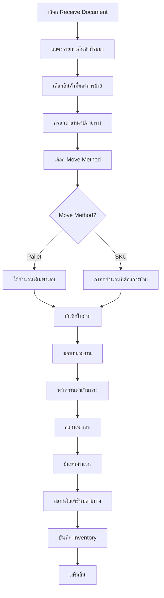
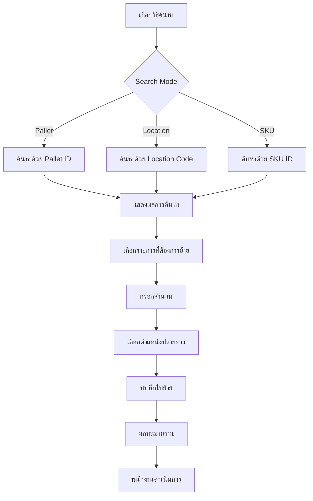

# 📋 TRANSFER ANALYSIS FOR MOBILE - วิเคราะห์ระบบย้ายสินค้าเพื่อพัฒนา Mobile

> **เอกสารวิเคราะห์ฉบับสมบูรณ์ 100%**
> วันที่สร้าง: 2025-01-20
> จุดประสงค์: วิเคราะห์ระบบ Transfer (ย้ายสินค้าในคลัง) แบบ Desktop เพื่อนำไปพัฒนาเป็น Mobile Application

---

## 📑 สารบัญ

1. [ภาพรวมระบบ Transfer](#1-ภาพรวมระบบ-transfer)
2. [Database Schema](#2-database-schema)
3. [API Endpoints](#3-api-endpoints)
4. [UI Components & Features](#4-ui-components--features)
5. [Workflow & Business Logic](#5-workflow--business-logic)
6. [Status & State Management](#6-status--state-management)
7. [Employee Assignment System](#7-employee-assignment-system)
8. [Scanning System](#8-scanning-system)
9. [Move Type & Scenarios](#9-move-type--scenarios)
10. [Inventory Integration](#10-inventory-integration)
11. [Location Validation](#11-location-validation)
12. [Pallet Grouping Logic](#12-pallet-grouping-logic)
13. [Search & Filter System](#13-search--filter-system)
14. [Modal Dialogs](#14-modal-dialogs)
15. [Existing Mobile App](#15-existing-mobile-app)
16. [Mobile Development Recommendations](#16-mobile-development-recommendations)
17. [คำศัพท์และคำแปล](#17-คำศัพท์และคำแปล)
18. [Summary & Next Steps](#18-summary--next-steps)

---

## 1. ภาพรวมระบบ Transfer

### 1.1 คืออะไร?
**Transfer (ย้ายสินค้าในคลัง)** คือระบบจัดการการเคลื่อนย้ายสินค้าภายในคลังสินค้า ตั้งแต่การสร้างใบย้าย มอบหมายงาน ดำเนินการย้าย ไปจนถึงการบันทึกสินค้าเข้าตำแหน่งใหม่

### 1.2 Use Cases หลัก

#### 1.2.1 **Putaway** (จัดเก็บสินค้า)
- ย้ายสินค้าจากพื้นที่รับของ (Receiving Area) ไปยังตำแหน่งจัดเก็บ (Storage Location)
- เชื่อมโยงกับ Receive Document (ใบรับสินค้า)
- เป็น Use Case หลักที่ใช้บ่อยที่สุด

#### 1.2.2 **Transfer** (ย้ายสินค้าทั่วไป)
- ย้ายสินค้าระหว่างตำแหน่งภายในคลัง
- ค้นหาสินค้าจาก Pallet ID, Location Code หรือ SKU
- ใช้สำหรับการปรับปรุงตำแหน่งสินค้า

#### 1.2.3 **Replenishment** (เติมสินค้า)
- เติมสินค้าจาก Storage Location ไปยัง Picking Location
- รองรับการเติมสินค้าแบบอัตโนมัติตามระดับสต็อก

#### 1.2.4 **Relocation** (ย้ายตำแหน่ง)
- ย้ายสินค้าไปตำแหน่งใหม่เพื่อการจัดเรียง
- ปรับปรุงประสิทธิภาพการจัดเก็บ

### 1.3 ขั้นตอนการทำงานหลัก

```
1. สร้างใบย้าย (Create Move Document)
   ↓
2. มอบหมายงาน (Assign to Employee)
   ↓
3. พนักงานเริ่มงาน (Start Work)
   ↓
4. สแกนพาเลท (Scan Pallet) ✓
   ↓
5. ยืนยันจำนวน (Confirm Quantity) [มือถือใช้]
   ↓
6. สแกนโลเคชั่นปลายทาง (Scan Destination Location) ✓
   ↓
7. บันทึก Inventory (Record to Inventory Balance)
   ↓
8. เสร็จสิ้น (Completed)
```

### 1.4 จำนวนรายการทั้งหมด
- **Desktop Page**: [app/warehouse/transfer/page.tsx](app/warehouse/transfer/page.tsx) - **2,691 บรรทัด**
- **Mobile Page (มีอยู่แล้ว)**: [app/mobile/transfer/[id]/page.tsx](app/mobile/transfer/[id]/page.tsx) - **479 บรรทัด**

---

## 2. Database Schema

### 2.1 ตารางหลัก: `wms_moves` (Header)

**ตารางนี้เก็บข้อมูลหัวเอกสารการย้ายสินค้า**

| Field | Type | Description | Required | Example |
|-------|------|-------------|----------|---------|
| `move_id` | integer | PK, Auto-increment | ✓ | 1 |
| `move_no` | text | เลขที่ใบย้าย (Unique) | ✓ | "MV-2025-0001" |
| `move_type` | text | ประเภทการย้าย | ✓ | "putaway" |
| `status` | text | สถานะเอกสาร | ✓ | "pending" |
| `from_warehouse_id` | text | คลังต้นทาง | - | "WH001" |
| `to_warehouse_id` | text | คลังปลายทาง | - | "WH001" |
| `scheduled_at` | timestamptz | กำหนดดำเนินการ | - | "2025-01-20T14:00:00Z" |
| `started_at` | timestamptz | เริ่มดำเนินการ | - | "2025-01-20T14:15:00Z" |
| `completed_at` | timestamptz | เสร็จสิ้น | - | "2025-01-20T15:30:00Z" |
| `reference_doc_id` | integer | FK → wms_receives.receive_id | - | 123 |
| `reference_doc_no` | text | เลขอ้างอิง (สำหรับ Putaway) | - | "RCV-2025-0050" |
| `notes` | text | หมายเหตุ | - | "ย้ายเข้าคลังด่วน" |
| `created_at` | timestamptz | วันที่สร้าง | ✓ | "2025-01-20T13:00:00Z" |
| `created_by` | text | ผู้สร้าง | - | "user@example.com" |
| `updated_at` | timestamptz | วันที่แก้ไขล่าสุด | - | "2025-01-20T15:30:00Z" |

#### Move Types (ประเภทการย้าย)
```typescript
type MoveType = 'putaway' | 'transfer' | 'replenishment' | 'relocation';

const MOVE_TYPE_LABELS = {
  'putaway': 'จัดเก็บสินค้า',
  'transfer': 'ย้ายสินค้า',
  'replenishment': 'เติมสินค้า',
  'relocation': 'ย้ายตำแหน่ง'
};
```

#### Move Header Statuses (สถานะเอกสาร)
```typescript
type MoveStatus = 'pending' | 'assigned' | 'in_progress' | 'completed' | 'cancelled';

const MOVE_STATUS_LABELS = {
  'pending': 'รอดำเนินการ',
  'assigned': 'มอบหมายแล้ว',
  'in_progress': 'กำลังดำเนินการ',
  'completed': 'เสร็จสิ้น',
  'cancelled': 'ยกเลิก'
};
```

### 2.2 ตารางรายการ: `wms_move_items` (Items)

**ตารางนี้เก็บรายการสินค้าแต่ละรายการที่ต้องย้าย**

| Field | Type | Description | Required | Example |
|-------|------|-------------|----------|---------|
| `move_item_id` | integer | PK, Auto-increment | ✓ | 1001 |
| `move_id` | integer | FK → wms_moves.move_id | ✓ | 1 |
| `sku_id` | text | FK → master_sku.sku_id | ✓ | "SKU001" |
| `from_location_id` | text | FK → master_location | - | "A01-01-001" |
| `to_location_id` | text | FK → master_location | - | "B02-03-015" |
| `pallet_id` | text | รหัสพาเลท | - | "ATG20251002000000002" |
| `move_method` | text | วิธีการย้าย | ✓ | "pallet" |
| `requested_pack_qty` | numeric | จำนวนแพ็คที่ร้องขอ | - | 10 |
| `requested_piece_qty` | numeric | จำนวนชิ้นที่ร้องขอ | ✓ | 100 |
| `confirmed_pack_qty` | numeric | จำนวนแพ็คที่ยืนยัน | - | 10 |
| `confirmed_piece_qty` | numeric | จำนวนชิ้นที่ยืนยัน | - | 98 |
| `status` | text | สถานะรายการ | ✓ | "in_progress" |
| `assigned_to` | integer | FK → master_employee | - | 5 |
| `assigned_role` | text | Role ที่มอบหมาย | - | "operator" |
| `assignment_type` | text | ประเภทการมอบหมาย | - | "individual" |
| `assignment_details` | jsonb | รายละเอียดการมอบหมาย | - | {...} |
| `executed_by` | integer | FK → master_employee | - | 5 |
| `started_at` | timestamptz | เริ่มดำเนินการ | - | "2025-01-20T14:20:00Z" |
| `pallet_scanned_at` | timestamptz | วันเวลาสแกนพาเลท | - | "2025-01-20T14:25:00Z" |
| `location_scanned_at` | timestamptz | วันเวลาสแกนโลเคชั่น | - | "2025-01-20T14:30:00Z" |
| `completed_at` | timestamptz | เสร็จสิ้น | - | "2025-01-20T14:32:00Z" |
| `remarks` | text | หมายเหตุ | - | "มีความเสียหาย 2 ชิ้น" |
| `created_at` | timestamptz | วันที่สร้าง | ✓ | "2025-01-20T13:00:00Z" |
| `updated_at` | timestamptz | วันที่แก้ไขล่าสุด | - | "2025-01-20T14:32:00Z" |

#### Move Methods (วิธีการย้าย)
```typescript
type MoveMethod = 'pallet' | 'sku';

// 'pallet' = ย้ายทั้งพาเลท (ใช้จำนวนเต็ม)
// 'sku' = ย้ายตามจำนวน (ระบุจำนวนที่ต้องการ)
```

#### Move Item Statuses (สถานะรายการ)
```typescript
type MoveItemStatus = 'pending' | 'assigned' | 'in_progress' | 'completed' | 'cancelled';

const MOVE_ITEM_STATUS_LABELS = {
  'pending': 'รอดำเนินการ',
  'assigned': 'มอบหมายแล้ว',
  'in_progress': 'กำลังดำเนินการ',
  'completed': 'เสร็จสิ้น',
  'cancelled': 'ยกเลิก'
};
```

#### Assignment Types (ประเภทการมอบหมาย)
```typescript
type AssignmentType = 'individual' | 'role' | 'mixed';

// 'individual' = มอบหมายให้คนเฉพาะ
// 'role' = มอบหมายตาม Role (ใครก็ได้ที่มี Role นี้)
// 'mixed' = มอบหมายแบบผสม (หัวหน้า + ทีม)
```

#### Assignment Details (JSONB Structure)
```typescript
interface AssignmentDetails {
  // For individual type
  employee_name?: string;
  assigned_at?: string;

  // For role type
  eligible_employees?: number[];
  role?: string;
  required_count?: number;

  // For mixed type
  primary_employee?: number;
  support_role?: string;
  support_count?: number;
}
```

### 2.3 ตารางที่เกี่ยวข้อง

#### 2.3.1 `master_sku` (สินค้า)
- `sku_id` (PK)
- `sku_name`
- `barcode`
- `weight_per_piece_kg`

#### 2.3.2 `master_location` (ตำแหน่งจัดเก็บ)
- `location_id` (PK)
- `location_code`
- `location_name`
- `location_type`
- `zone`
- `warehouse_id`
- `active_status` - **สำคัญ**: ตรวจสอบก่อนย้าย
- `current_qty` - จำนวนสินค้าปัจจุบัน
- `current_weight_kg` - น้ำหนักปัจจุบัน
- `max_capacity_qty` - ความจุสูงสุด (ชิ้น)
- `max_capacity_weight_kg` - ความจุสูงสุด (กก.)

#### 2.3.3 `master_employee` (พนักงาน)
- `employee_id` (PK)
- `employee_code`
- `first_name`
- `last_name`
- `email`
- `wms_role` - Role ในคลัง (supervisor, operator, picker, driver, forklift, other)

#### 2.3.4 `wms_receives` (ใบรับสินค้า - สำหรับ Putaway)
- `receive_id` (PK)
- `receive_no`
- `status`
- `supplier_id`
- `warehouse_id`
- `wms_receive_items` (รายการสินค้า)

#### 2.3.5 `wms_inventory_balances` (สต็อกคงคลัง)
- `balance_id` (PK)
- `warehouse_id`
- `location_id`
- `sku_id`
- `pallet_id`
- `pallet_id_external`
- `piece_qty`
- `pack_qty`
- `created_at`
- `updated_at`

---

## 3. API Endpoints

### 3.1 GET `/api/moves`
**ดึงรายการใบย้ายทั้งหมด พร้อม Filter**

#### Request Parameters (Query String)
```typescript
{
  status?: MoveStatus | 'all',
  move_type?: MoveType | 'all',
  warehouse_id?: string,
  start_date?: string,    // ISO format
  end_date?: string,      // ISO format
  search?: string         // ค้นหา move_no, reference_doc_no
}
```

#### Response
```typescript
{
  data: MoveRecord[] | null,
  error: string | null
}

interface MoveRecord {
  move_id: number;
  move_no: string;
  move_type: MoveType;
  status: MoveStatus;
  from_warehouse_id: string | null;
  to_warehouse_id: string | null;
  scheduled_at: string | null;
  started_at: string | null;
  completed_at: string | null;
  reference_doc_id: number | null;
  reference_doc_no: string | null;
  notes: string | null;
  created_at: string;
  created_by: string | null;
  updated_at: string | null;

  // Joined data
  wms_move_items?: MoveItemRecord[];
}
```

#### ใช้งานที่ไหน
- Desktop: Main table display
- Mobile: List view (จะพัฒนา)

---

### 3.2 POST `/api/moves`
**สร้างใบย้ายใหม่**

#### Request Body
```typescript
interface CreateMovePayload {
  move_type: MoveType;
  from_warehouse_id?: string;
  to_warehouse_id?: string;
  scheduled_at?: string;      // ISO format
  reference_doc_id?: number;  // For putaway
  reference_doc_no?: string;  // For putaway
  notes?: string;
  items: CreateMoveItemPayload[];
}

interface CreateMoveItemPayload {
  sku_id: string;
  from_location_id?: string;
  to_location_id?: string;
  pallet_id?: string;
  move_method: 'pallet' | 'sku';
  requested_pack_qty?: number;
  requested_piece_qty: number;
}
```

#### Validation Rules
- ✓ `move_type` required
- ✓ อย่างน้อย 1 warehouse ID (from หรือ to)
- ✓ `items` มีอย่างน้อย 1 รายการ
- ✓ แต่ละ item ต้องมี `sku_id`, `move_method`, `requested_piece_qty`

#### Response
```typescript
{
  data: MoveRecord | null,
  error: string | null
}
```

#### ใช้งานที่ไหน
- Desktop: Create Move Modal
- Mobile: ไม่ใช้ (สร้างจาก Desktop เท่านั้น)

---

### 3.3 GET `/api/moves/items/[id]`
**ดึงข้อมูล Move Item เดียว**

#### Response
```typescript
{
  data: MoveItemRecord | null,
  error: string | null
}

interface MoveItemRecord {
  move_item_id: number;
  move_id: number;
  sku_id: string;
  from_location_id: string | null;
  to_location_id: string | null;
  pallet_id: string | null;
  move_method: 'pallet' | 'sku';
  requested_pack_qty: number;
  requested_piece_qty: number;
  confirmed_pack_qty: number;
  confirmed_piece_qty: number;
  status: MoveItemStatus;
  assigned_to: number | null;
  assigned_role: string | null;
  assignment_type: string | null;
  assignment_details: any;
  executed_by: number | null;
  started_at: string | null;
  pallet_scanned_at: string | null;
  location_scanned_at: string | null;
  completed_at: string | null;
  remarks: string | null;
  created_at: string;
  updated_at: string | null;

  // Joined data
  master_sku?: { sku_name: string; barcode: string };
  from_location?: { location_name: string; location_code: string };
  to_location?: { location_name: string; location_code: string };
}
```

---

### 3.4 PATCH `/api/moves/items/[id]`
**อัพเดท Move Item (ใช้ในการทำงานบนมือถือ)**

#### Updatable Fields
```typescript
const UPDATABLE_FIELDS = [
  'status',
  'confirmed_pack_qty',
  'confirmed_piece_qty',
  'remarks',
  'from_location_id',
  'to_location_id',
  'assigned_to',
  'pallet_scanned_at',
  'location_scanned_at',
  'executed_by',
  'started_at',
  'completed_at',
  'assignment_type',
  'assigned_role',
  'assignment_details'
];
```

#### Request Body Example
```typescript
// เริ่มงาน
{
  status: 'in_progress',
  started_at: '2025-01-20T14:20:00Z',
  executed_by: 5
}

// เสร็จงาน
{
  status: 'completed',
  confirmed_pack_qty: 10,
  confirmed_piece_qty: 98,
  completed_at: '2025-01-20T14:32:00Z'
}
```

#### Business Logic เมื่อ `status = 'completed'`
1. ✅ **ตรวจสอบโลเคชั่นปลายทาง**
   - ต้องมี `to_location_id`
   - Location ต้อง `active_status = 'active'`
   - ตรวจสอบความจุ (quantity)
   - ตรวจสอบความจุ (weight)

2. ✅ **บันทึก Inventory Movement**
   - เรียก `moveService.recordInventoryMovement()`
   - อัพเดท `wms_inventory_balances`
   - ลดจำนวนจาก from_location
   - เพิ่มจำนวนที่ to_location

3. ✅ **อัพเดทสถานะ Header**
   - เรียก `moveService.recalculateMoveHeaderStatus()`
   - ถ้าทุก item เสร็จ → Header เป็น 'completed'
   - ถ้ามีบาง item เสร็จ → Header เป็น 'in_progress'

#### Response
```typescript
{
  data: MoveItemRecord | null,
  error: string | null
}
```

#### Error Messages
```typescript
// โลเคชั่นไม่ active
"โลเคชั่น B02-03-015 ไม่อยู่ในสถานะใช้งาน"

// เกินความจุ (ชิ้น)
"โลเคชั่น B02-03-015 เกินความจุ (จำนวนชิ้น): ความจุ 1,000 ชิ้น, ปัจจุบัน 920 ชิ้น, จะเพิ่ม 100 ชิ้น"

// เกินความจุ (น้ำหนัก)
"โลเคชั่น B02-03-015 เกินความจุ (น้ำหนัก): ความจุ 500 กก., ปัจจุบัน 450 กก., จะเพิ่มประมาณ 50 กก."
```

---

### 3.5 GET `/api/inventory/balances`
**ดึงข้อมูลสต็อกคงคลัง (ใช้สำหรับค้นหาสินค้าเพื่อย้าย)**

#### Request Parameters
```typescript
{
  warehouse_id?: string,
  location_id?: string,
  sku_id?: string,
  pallet_id?: string,     // ค้นหาทั้ง pallet_id และ pallet_id_external
  limit?: string          // Default: 100
}
```

#### Response
```typescript
{
  data: InventoryBalance[],
  error: string | null
}

interface InventoryBalance {
  balance_id: number;
  warehouse_id: string;
  location_id: string;
  sku_id: string;
  pallet_id: string | null;
  pallet_id_external: string | null;
  piece_qty: number;
  pack_qty: number;
  created_at: string;
  updated_at: string;

  // Joined data
  master_sku?: {
    sku_id: string;
    sku_name: string;
    weight_per_piece_kg: number;
  };
  master_location?: {
    location_id: string;
    location_code: string;
    location_name: string;
    location_type: string;
    zone: string;
  };
}
```

#### ใช้งานที่ไหน
- Desktop: Transfer Mode - ค้นหาสินค้าเพื่อย้าย
- Mobile: ไม่ใช้ (Mobile ทำงานจากใบที่สร้างแล้ว)

---

## 4. UI Components & Features

### 4.1 Main Table (Desktop)

#### 4.1.1 Header Columns (6 คอลัมน์)
| Column | Width | Sortable | Description |
|--------|-------|----------|-------------|
| เลขที่ใบย้าย | 12% | ✓ | `move_no` + Expand button |
| ประเภท | 10% | ✓ | `move_type` label |
| สถานะ | 10% | ✓ | Badge with color |
| ตำแหน่งต้นทาง → ปลายทาง | 25% | ✓ | From/To locations |
| จำนวนสินค้า | 8% | ✓ | Item count |
| กำหนดดำเนินการ | 15% | ✓ | `scheduled_at` |
| การจัดการ | 10% | - | Actions (จัดการระดับ items) |

#### 4.1.2 Expandable Row (Item Details)
เมื่อคลิก expand จะแสดงตารางย่อย:

| Column | Description |
|--------|-------------|
| สินค้า | SKU name |
| ต้นทาง | From location |
| ปลายทาง | To location |
| ชิ้น | `requested_piece_qty` |
| แพ็ค | `requested_pack_qty` |
| วิธีย้าย | "ทั้งพาเลท" / "ตามจำนวน" |
| พาเลท | `pallet_id` |
| สถานะ | Badge (pending/assigned/in_progress/completed) |
| การจัดการ | Action buttons |

#### 4.1.3 Action Buttons (ตามสถานะ)
```typescript
// pending → มอบหมาย (Assign)
<Button onClick={openAssignmentDialog}>มอบหมาย</Button>

// assigned → เริ่มงาน (Start Work)
<Button onClick={handleStartWork}>เริ่มงาน</Button>

// in_progress → สแกนเพื่อเสร็จงาน (Scan to Complete)
<Button onClick={handleStartScanning}>สแกนเพื่อเสร็จงาน</Button>

// completed → เสร็จสิ้น (No button)
<span className="text-green-600">เสร็จสิ้น</span>
```

### 4.2 Filter Bar

#### 4.2.1 Search Input
- ค้นหา `move_no` หรือ `reference_doc_no`
- Real-time filtering (client-side)
- Icon: Search

#### 4.2.2 Status Filter
```typescript
const STATUS_OPTIONS = [
  { value: 'all', label: 'ทุกสถานะ' },
  { value: 'pending', label: 'รอดำเนินการ' },
  { value: 'assigned', label: 'มอบหมายแล้ว' },
  { value: 'in_progress', label: 'กำลังดำเนินการ' },
  { value: 'completed', label: 'เสร็จสิ้น' },
  { value: 'cancelled', label: 'ยกเลิก' }
];
```

#### 4.2.3 Type Filter
```typescript
const TYPE_OPTIONS = [
  { value: 'all', label: 'ทุกประเภท' },
  { value: 'putaway', label: 'จัดเก็บสินค้า' },
  { value: 'transfer', label: 'ย้ายสินค้า' },
  { value: 'replenishment', label: 'เติมสินค้า' },
  { value: 'relocation', label: 'ย้ายตำแหน่ง' }
];
```

#### 4.2.4 Date Range Filter
- Start Date (input type="date")
- End Date (input type="date")
- Filter by `scheduled_at`

### 4.3 Column Resizing
- สามารถปรับขนาดคอลัมน์ได้ (Drag handle ขวาของแต่ละ header)
- เก็บ state ด้วย `columnWidths`
- ใช้ Pointer events (onPointerDown, onPointerMove, onPointerUp)

### 4.4 Sorting
- คลิกที่ header เพื่อ sort
- แสดง icon: ArrowUpDown (neutral), ArrowUp (asc), ArrowDown (desc)
- รองรับ 6 fields: move_no, move_type, status, locations, item_count, scheduled_at
- Sort ภาษาไทยด้วย `localeCompare('th')`

### 4.5 Pallet Grouping Display
**Logic สำคัญ**: ถ้าหลาย items มีพาเลทเดียวกัน + from_location เดียวกัน + to_location เดียวกัน → จัดกลุ่ม

```typescript
// แสดงเป็น rowspan สำหรับ:
// - Checkbox (1 checkbox ต่อกลุ่ม)
// - From Location (แสดงครั้งเดียว)
// - To Location (แสดงครั้งเดียว)
// - Move Method (แสดงครั้งเดียว)
// - Pallet ID (แสดงครั้งเดียว)
// - Status (แสดงครั้งเดียว)
// - Actions (แสดงครั้งเดียว)

// แสดงแยกแถวสำหรับ:
// - SKU Name (แต่ละ SKU)
// - Quantity (แต่ละ SKU)
```

### 4.6 Badge Variants
```typescript
function getStatusVariant(status: MoveStatus): BadgeVariant {
  switch (status) {
    case 'pending': return 'default';
    case 'assigned': return 'info';
    case 'in_progress': return 'warning';
    case 'completed': return 'success';
    case 'cancelled': return 'destructive';
  }
}

function getItemStatusVariant(status: MoveItemStatus): BadgeVariant {
  switch (status) {
    case 'pending': return 'default';
    case 'assigned': return 'info';
    case 'in_progress': return 'warning';
    case 'completed': return 'success';
    case 'cancelled': return 'destructive';
  }
}
```

---

## 5. Workflow & Business Logic

### 5.1 Putaway Workflow (จัดเก็บสินค้า)



#### 5.1.1 การเลือกใบรับสินค้า
```typescript
// เงื่อนไข:
// 1. status !== 'กำลังตรวจสอบ' (ต้องตรวจสอบเสร็จแล้ว)
// 2. มี wms_receive_items

if (selected?.status === 'กำลังตรวจสอบ') {
  alert('ไม่สามารถสร้างใบย้ายได้: สินค้านี้อยู่ในสถานะ "กำลังตรวจสอบ" กรุณารอให้การตรวจสอบเสร็จสิ้นก่อน');
  return;
}
```

#### 5.1.2 การจัดกลุ่มพาเลท (Auto Grouping)
```typescript
// Logic: รวมสินค้าที่มี pallet_id เดียวกัน
// แสดงใน UI แบบ rowspan
// เลือก 1 checkbox ต่อพาเลท → เลือกทุก SKU ในพาเลท
// กรอกตำแหน่งปลายทาง 1 ครั้ง → ใช้กับทุก SKU ในพาเลท
```

#### 5.1.3 Validation ก่อนบันทึก
```typescript
// 1. ต้องเลือกอย่างน้อย 1 item
if (selectedCount === 0) {
  setFormError('กรุณาเลือกสินค้าที่ต้องการย้ายอย่างน้อย 1 รายการ');
  return;
}

// 2. ทุก item ที่เลือกต้องมี toLocationId
const missingLocations = selectedItems.filter(item => !item.toLocationId);
if (missingLocations.length > 0) {
  setFormError('กรุณาระบุตำแหน่งปลายทางสำหรับทุกรายการที่เลือก');
  return;
}

// 3. Warn ถ้ามี duplicate locations
if (duplicateLocations.length > 0) {
  const confirm = window.confirm(
    `พบโลเคชั่นซ้ำ ${duplicateLocations.length} ตำแหน่ง ต้องการดำเนินการต่อหรือไม่?`
  );
  if (!confirm) return;
}
```

#### 5.1.4 การสร้างเอกสาร
```typescript
const payload: CreateMovePayload = {
  move_type: 'putaway',
  to_warehouse_id: selectedToWarehouse,
  reference_doc_id: selectedReceive.receive_id,
  reference_doc_no: selectedReceive.receive_no,
  scheduled_at: scheduledAt || undefined,
  notes: notes.trim() || undefined,
  items: selectedItems.map(item => ({
    sku_id: item.sku_id,
    from_location_id: item.location_id || undefined,
    to_location_id: item.toLocationId,
    pallet_id: item.pallet_id || undefined,
    move_method: item.moveMethod,
    requested_pack_qty: item.pack_quantity || 0,
    requested_piece_qty: item.moveMethod === 'pallet'
      ? item.piece_quantity
      : item.pieceQty
  }))
};
```

### 5.2 Transfer Workflow (ย้ายสินค้าทั่วไป)



#### 5.2.1 Search Modes
```typescript
type TransferSearchMode = 'pallet' | 'location' | 'sku';

// Search by Pallet
// → Query: /api/inventory/balances?pallet_id=XXX&warehouse_id=YYY

// Search by Location
// → Query: /api/inventory/balances?location_id=XXX&warehouse_id=YYY

// Search by SKU
// → Query: /api/inventory/balances?sku_id=XXX&warehouse_id=YYY
```

#### 5.2.2 การเลือกรายการ
```typescript
interface TransferSelectedItem {
  key: string;                    // Unique: `${sku_id}-${location_id}-${pallet_id}`
  sku_id: string;
  sku_name: string;
  from_location_id: string;
  from_location_code: string;
  pallet_id: string | null;
  piece_qty: number;              // จำนวนที่ต้องการย้าย
  to_location_id: string;         // ตำแหน่งปลายทาง
  move_method: 'pallet' | 'sku';
}
```

#### 5.2.3 Duplicate Prevention
```typescript
const alreadySelected = transferSelectedItems.some(
  (item) => item.key === result.key
);

if (alreadySelected) {
  // Disable "เลือก" button
}
```

### 5.3 Employee Assignment Workflow

#### 5.3.1 Assignment Types

**Individual (เจาะจงคน)**
```typescript
// มอบหมายให้พนักงานคนเดียว
{
  assignment_type: 'individual',
  assigned_to: employee_id,
  assignment_details: {
    employee_name: 'ชื่อ นามสกุล',
    assigned_at: '2025-01-20T14:00:00Z'
  }
}
```

**Role (ตาม Role)**
```typescript
// มอบหมายให้ Role ใด Role หนึ่ง (ใครก็ได้ที่มี Role นี้สามารถรับงานได้)
{
  assignment_type: 'role',
  assigned_role: 'operator',
  assignment_details: {
    role: 'operator',
    eligible_employees: [5, 8, 12, 15],  // รายชื่อพนักงานที่มี Role นี้
    required_count: 2  // ต้องการ 2 คน
  }
}
```

**Mixed (ผสม)**
```typescript
// มอบหมายให้หัวหน้าทีม + ทีมช่วยงาน
{
  assignment_type: 'mixed',
  assigned_to: 5,              // หัวหน้าทีม
  assigned_role: 'operator',   // Role ของทีม
  assignment_details: {
    primary_employee: 5,
    support_role: 'operator',
    support_count: 1  // ต้องการคนช่วย 1 คน
  }
}
```

#### 5.3.2 Bulk Assignment
```typescript
// มอบหมายทั้งใบย้าย (ทุก item ที่ pending)
const pendingItems = move.wms_move_items.filter(item => item.status === 'pending');
const moveItemIds = pendingItems.map(item => item.move_item_id);

// มอบหมายพร้อมกันทุก item
for (const moveItemId of moveItemIds) {
  await fetch(`/api/moves/items/${moveItemId}`, {
    method: 'PATCH',
    body: JSON.stringify(assignmentPayload)
  });
}
```

### 5.4 Start Work Workflow

```typescript
async function handleStartWork(item: MoveItemRecord) {
  // เปลี่ยนสถานะจาก 'assigned' → 'in_progress'
  await fetch(`/api/moves/items/${item.move_item_id}`, {
    method: 'PATCH',
    body: JSON.stringify({
      status: 'in_progress',
      started_at: new Date().toISOString(),
      executed_by: currentUser.employee_id  // บันทึกว่าใครเริ่มงาน
    })
  });
}
```

### 5.5 Scanning Workflow (Desktop)

#### Step 1: Scan Pallet
```typescript
// เปิด Scan Modal
setScanningMoveItem(item);
setScanningStep('pallet');
setIsScanModalOpen(true);

// รอให้พนักงานสแกน
const scannedPalletId = /* จาก input */;

// Validate
if (item.pallet_id && scannedPalletId !== item.pallet_id) {
  setScanError('พาเลทไม่ตรงกัน กรุณาสแกนใหม่');
  return;
}

// ผ่าน → ไปขั้นตอนต่อไป
setScannedPalletId(scannedPalletId);
setScanningStep('location');
```

#### Step 2: Scan Location
```typescript
const scannedLocationId = /* จาก input */;

// Validate
const expectedCode = item.to_location?.location_code;
const expectedId = item.to_location_id;

if (scannedLocationId !== expectedCode && scannedLocationId !== expectedId) {
  setScanError('โลเคชั่นไม่ตรงกัน กรุณาสแกนใหม่');
  return;
}

// ผ่าน → เสร็จงาน
await fetch(`/api/moves/items/${item.move_item_id}`, {
  method: 'PATCH',
  body: JSON.stringify({
    status: 'completed',
    pallet_scanned_at: /* วันเวลาสแกนพาเลท */,
    location_scanned_at: new Date().toISOString(),
    completed_at: new Date().toISOString()
  })
});

// API จะทำ:
// 1. ตรวจสอบ location capacity
// 2. บันทึก inventory movement
// 3. อัพเดทสถานะ header
```

---

## 6. Status & State Management

### 6.1 Move Header Status Flow

```
pending (สร้างใหม่)
  ↓
assigned (มอบหมายแล้วทุก item)
  ↓
in_progress (มี item บางตัวเริ่มงานแล้ว)
  ↓
completed (ทุก item เสร็จสิ้น)
```

**Auto Recalculation Logic:**
```typescript
// ใน API: /api/moves/items/[id] PATCH
// หลังจากอัพเดท item แล้ว → เรียก
await moveService.recalculateMoveHeaderStatus(move_id);

// Logic:
const items = /* ดึง items ทั้งหมดใน move_id */;
const allCompleted = items.every(item => item.status === 'completed');
const someInProgress = items.some(item => item.status === 'in_progress');
const allAssigned = items.every(item => item.status === 'assigned');

if (allCompleted) {
  // อัพเดท header เป็น 'completed'
  // บันทึก completed_at
} else if (someInProgress) {
  // อัพเดท header เป็น 'in_progress'
  // บันทึก started_at (ถ้ายังไม่มี)
} else if (allAssigned) {
  // อัพเดท header เป็น 'assigned'
}
```

### 6.2 Move Item Status Flow

```
pending (สร้างใหม่)
  ↓
assigned (มอบหมายให้พนักงาน)
  ↓
in_progress (พนักงานเริ่มงาน)
  ↓
completed (สแกนเสร็จสิ้น)
```

### 6.3 State Variables (Desktop Component)

```typescript
// Data
const [moves, setMoves] = useState<MoveRecord[]>([]);
const [loading, setLoading] = useState(true);
const [error, setError] = useState<string | null>(null);

// Filters
const [searchTerm, setSearchTerm] = useState('');
const [statusFilter, setStatusFilter] = useState<MoveStatus | 'all'>('all');
const [typeFilter, setTypeFilter] = useState<MoveType | 'all'>('all');
const [startDate, setStartDate] = useState('');
const [endDate, setEndDate] = useState('');

// UI State
const [expandedMoves, setExpandedMoves] = useState<Set<number>>(new Set());
const [sortField, setSortField] = useState<string>('');
const [sortDirection, setSortDirection] = useState<'asc' | 'desc'>('asc');
const [columnWidths, setColumnWidths] = useState({
  move_no: 12,
  move_type: 10,
  status: 10,
  locations: 25,
  item_count: 8,
  scheduled_at: 15,
  actions: 10
});
const [isResizing, setIsResizing] = useState<string | null>(null);

// Create Modal
const [isCreateModalOpen, setIsCreateModalOpen] = useState(false);
const [moveType, setMoveType] = useState<MoveType>('putaway');
const [selectedToWarehouse, setSelectedToWarehouse] = useState('');
const [selectedReceiveId, setSelectedReceiveId] = useState<number | null>(null);
const [scheduledAt, setScheduledAt] = useState('');
const [notes, setNotes] = useState('');
const [draftItems, setDraftItems] = useState<Record<number, DraftItem>>({});
const [creatingMove, setCreatingMove] = useState(false);
const [formError, setFormError] = useState<string | null>(null);

// Transfer Mode (for non-putaway)
const [transferSearchMode, setTransferSearchMode] = useState<'pallet' | 'location' | 'sku'>('pallet');
const [transferFromWarehouse, setTransferFromWarehouse] = useState('');
const [transferSearchTerm, setTransferSearchTerm] = useState('');
const [transferSearchResults, setTransferSearchResults] = useState<any[]>([]);
const [transferSelectedItems, setTransferSelectedItems] = useState<TransferSelectedItem[]>([]);
const [transferSearchLoading, setTransferSearchLoading] = useState(false);
const [transferSearchError, setTransferSearchError] = useState<string | null>(null);

// Assignment Modal
const [isAssignModalOpen, setIsAssignModalOpen] = useState(false);
const [selectedMoveItemIds, setSelectedMoveItemIds] = useState<number[]>([]);
const [assignmentContext, setAssignmentContext] = useState({
  mode: 'single' as 'single' | 'bulk',
  moveNo: '',
  description: '',
  total: 0
});
const [selectedEmployeeId, setSelectedEmployeeId] = useState<number | null>(null);
const [assignmentType, setAssignmentType] = useState<'individual' | 'role' | 'mixed'>('individual');
const [selectedRole, setSelectedRole] = useState('');
const [requiredCount, setRequiredCount] = useState(1);

// Scan Modal
const [isScanModalOpen, setIsScanModalOpen] = useState(false);
const [scanningMoveItem, setScanningMoveItem] = useState<MoveItemRecord | null>(null);
const [scanningStep, setScanningStep] = useState<'pallet' | 'location'>('pallet');
const [scannedPalletId, setScannedPalletId] = useState('');
const [scannedLocationId, setScannedLocationId] = useState('');
const [scanError, setScanError] = useState<string | null>(null);
const [isCompletingScan, setIsCompletingScan] = useState(false);

// Update Flags
const [updatingItemStatus, setUpdatingItemStatus] = useState(false);
const [updatingStatus, setUpdatingStatus] = useState(false);
```

---

## 7. Employee Assignment System

### 7.1 Assignment Context

```typescript
interface AssignmentContext {
  mode: 'single' | 'bulk';
  moveNo?: string;
  description?: string;
  total: number;
}

// Single mode: มอบหมาย item เดียว หรือกลุ่มพาเลท
openAssignmentDialog([item.move_item_id], {
  mode: 'single',
  moveNo: 'MV-2025-0001',
  description: 'SKU001 - สินค้าตัวอย่าง'
});

// Bulk mode: มอบหมายทั้งใบย้าย
openAssignmentDialog(pendingItemIds, {
  mode: 'bulk',
  moveNo: 'MV-2025-0001',
  description: 'สินค้าในใบนี้'
});
```

### 7.2 Employee List Display

```tsx
<table>
  <thead>
    <tr>
      <th>เลือก</th>
      <th>ชื่อพนักงาน</th>
      <th>Role</th>
      <th>อีเมล</th>
    </tr>
  </thead>
  <tbody>
    {employees.map(employee => (
      <tr onClick={() => setSelectedEmployeeId(employee.employee_id)}>
        <td>
          <input type="radio" checked={selectedEmployeeId === employee.employee_id} />
        </td>
        <td>{employee.first_name} {employee.last_name}</td>
        <td><Badge>{employee.wms_role || 'ไม่ระบุ'}</Badge></td>
        <td>{employee.email || '-'}</td>
      </tr>
    ))}
  </tbody>
</table>
```

### 7.3 Role Options

```typescript
const ROLE_OPTIONS = [
  { value: 'supervisor', label: 'หัวหน้าคลัง (Supervisor)' },
  { value: 'operator', label: 'พนักงานดำเนินการ (Operator)' },
  { value: 'picker', label: 'พนักงานหยิบสินค้า (Picker)' },
  { value: 'driver', label: 'พนักงานขับรถ (Driver)' },
  { value: 'forklift', label: 'พนักงานขับโฟล์คลิฟท์ (Forklift)' },
  { value: 'other', label: 'อื่นๆ (Other)' }
];
```

### 7.4 Assignment Payload

```typescript
const assignmentPayload = {
  status: 'assigned',
  assignment_type: assignmentType,
  assigned_to: assignmentType === 'individual' || assignmentType === 'mixed'
    ? selectedEmployeeId
    : undefined,
  assigned_role: assignmentType === 'role' || assignmentType === 'mixed'
    ? selectedRole
    : undefined,
  assignment_details: {
    // ... based on type
  }
};
```

---

## 8. Scanning System

### 8.1 Desktop Scanning Flow

#### Modal Structure
```tsx
<Modal isOpen={isScanModalOpen} title={scanningStep === 'pallet' ? 'ขั้นตอนที่ 1: สแกนพาเลท' : 'ขั้นตอนที่ 2: สแกนโลเคชั่น'}>
  {scanError && <ErrorAlert>{scanError}</ErrorAlert>}

  {/* รายละเอียดงาน */}
  <div>
    <div>สินค้า: {scanningMoveItem.master_sku?.sku_name}</div>
    <div>จำนวน: {scanningMoveItem.requested_piece_qty} ชิ้น</div>
    <div>พาเลท: {scanningMoveItem.pallet_id}</div>
    <div>ต้นทาง: {scanningMoveItem.from_location?.location_name}</div>
    <div>ปลายทาง: {scanningMoveItem.to_location?.location_name}</div>
  </div>

  {scanningStep === 'pallet' && (
    <div>
      <input
        value={scannedPalletId}
        onChange={(e) => setScannedPalletId(e.target.value)}
        placeholder="สแกนหรือป้อนรหัสพาเลท"
        autoFocus
      />
      <Button onClick={handlePalletScan}>ยืนยันพาเลท</Button>
    </div>
  )}

  {scanningStep === 'location' && (
    <div>
      <SuccessAlert>✅ พาเลทยืนยันแล้ว: {scannedPalletId}</SuccessAlert>
      <input
        value={scannedLocationId}
        onChange={(e) => setScannedLocationId(e.target.value)}
        placeholder="สแกนหรือป้อนรหัสโลเคชั่น"
        autoFocus
      />
      <Button onClick={handleLocationScan} disabled={isCompletingScan}>
        {isCompletingScan ? 'กำลังบันทึก...' : 'เสร็จสิ้นงาน'}
      </Button>
    </div>
  )}
</Modal>
```

#### Validation Logic
```typescript
// Step 1: Pallet Validation
function handlePalletScan() {
  if (!scannedPalletId.trim()) {
    setScanError('กรุณาสแกนหรือป้อนรหัสพาเลท');
    return;
  }

  const expected = scanningMoveItem.pallet_id;
  if (expected && scannedPalletId !== expected) {
    setScanError(`พาเลทไม่ตรงกัน\nคาดหวัง: ${expected}\nสแกน: ${scannedPalletId}`);
    return;
  }

  // ผ่าน
  setScanError(null);
  setScanningStep('location');
}

// Step 2: Location Validation
async function handleLocationScan() {
  if (!scannedLocationId.trim()) {
    setScanError('กรุณาสแกนหรือป้อนรหัสโลเคชั่น');
    return;
  }

  const expectedCode = scanningMoveItem.to_location?.location_code;
  const expectedId = scanningMoveItem.to_location_id;

  if (scannedLocationId !== expectedCode && scannedLocationId !== expectedId) {
    setScanError(`โลเคชั่นไม่ตรงกัน\nคาดหวัง: ${expectedCode || expectedId}\nสแกน: ${scannedLocationId}`);
    return;
  }

  // ผ่าน → เสร็จงาน
  setIsCompletingScan(true);
  try {
    await fetch(`/api/moves/items/${scanningMoveItem.move_item_id}`, {
      method: 'PATCH',
      body: JSON.stringify({
        status: 'completed',
        pallet_scanned_at: /* วันเวลาที่สแกนพาเลท */,
        location_scanned_at: new Date().toISOString(),
        completed_at: new Date().toISOString()
      })
    });

    // ปิด modal, refresh data
    setIsScanModalOpen(false);
    refetch();
  } catch (error) {
    setScanError('เกิดข้อผิดพลาดในการบันทึก');
  } finally {
    setIsCompletingScan(false);
  }
}
```

### 8.2 Mobile Scanning Flow

**Mobile App ใช้ workflow แตกต่าง:**

```
1. สแกนพาเลท (Scan Pallet)
   ↓
2. ยืนยันจำนวน (Confirm Quantity) → แก้ไขได้
   ↓
3. สแกนโลเคชั่นปลายทาง (Scan To Location)
   ↓
4. เสร็จสิ้น
```

**ความแตกต่าง:**
- Mobile มีขั้นตอน "ยืนยันจำนวน" ระหว่างทาง (Desktop ไม่มี)
- Mobile แสดง Step Indicator
- Mobile แสดง Progress Bar ของทั้งใบย้าย

---

## 9. Move Type & Scenarios

### 9.1 Putaway (จัดเก็บสินค้า)

**เมื่อใช้:**
- หลังจากรับสินค้าเข้าคลังแล้ว (Receive Document)
- ต้องย้ายจากพื้นที่รับของไปยังตำแหน่งจัดเก็บ

**ขั้นตอน:**
1. เลือก Receive Document
2. เลือกสินค้าที่ต้องการย้าย
3. กรอกตำแหน่งปลายทาง (to_location_id)
4. เลือก Move Method (pallet/sku)
5. บันทึก

**ข้อมูลพิเศษ:**
- `reference_doc_id` = receive_id
- `reference_doc_no` = receive_no
- `from_location_id` อาจเป็น null (ถ้ายังไม่ได้วางที่ไหน)
- `to_location_id` required

### 9.2 Transfer (ย้ายสินค้าทั่วไป)

**เมื่อใช้:**
- ย้ายสินค้าระหว่างตำแหน่งในคลัง
- ไม่เกี่ยวข้องกับ Receive Document

**ขั้นตอน:**
1. เลือกวิธีค้นหา (Pallet/Location/SKU)
2. ค้นหาสินค้า
3. เลือกรายการที่ต้องการย้าย
4. กรอกจำนวน
5. เลือกตำแหน่งปลายทาง
6. บันทึก

**ข้อมูลพิเศษ:**
- `from_location_id` required (ค้นหาจาก inventory)
- `to_location_id` required
- `reference_doc_id` = null

### 9.3 Replenishment (เติมสินค้า)

**เมื่อใช้:**
- เติมสินค้าจาก Storage Location ไปยัง Picking Location
- เมื่อ Picking Location สินค้าใกล้หมด

**Scenario:**
```
Storage: A01-01-001 (มีสินค้า 1000 ชิ้น)
  ↓
Picking: B05-02-010 (เหลือ 50 ชิ้น, ต้องเติม)
```

### 9.4 Relocation (ย้ายตำแหน่ง)

**เมื่อใช้:**
- ปรับปรุงการจัดเรียงสินค้า
- ย้ายสินค้าไปตำแหน่งที่เหมาะสมกว่า
- เพิ่มประสิทธิภาพการหยิบสินค้า

---

## 10. Inventory Integration

### 10.1 Inventory Recording

**เมื่อใด:** เมื่อ move item เปลี่ยนเป็น `status = 'completed'`

**API ที่เกี่ยวข้อง:**
```typescript
// ใน /api/moves/items/[id] PATCH
if (isCompletingItem) {
  await moveService.recordInventoryMovement(moveItem, moveHeader);
}
```

### 10.2 Record Logic

```typescript
async function recordInventoryMovement(
  moveItem: MoveItemRecord,
  moveHeader: MoveRecord
) {
  const pieceQty = moveItem.confirmed_piece_qty || moveItem.requested_piece_qty;
  const packQty = moveItem.confirmed_pack_qty || moveItem.requested_pack_qty || 0;

  // 1. ลดจาก from_location (ถ้ามี)
  if (moveItem.from_location_id) {
    await supabase
      .from('wms_inventory_balances')
      .update({
        piece_qty: /* ลดลง */,
        pack_qty: /* ลดลง */,
        updated_at: new Date().toISOString()
      })
      .eq('location_id', moveItem.from_location_id)
      .eq('sku_id', moveItem.sku_id)
      .eq('pallet_id', moveItem.pallet_id || null);
  }

  // 2. เพิ่มที่ to_location
  await supabase
    .from('wms_inventory_balances')
    .insert({
      warehouse_id: moveHeader.to_warehouse_id,
      location_id: moveItem.to_location_id,
      sku_id: moveItem.sku_id,
      pallet_id: moveItem.pallet_id,
      piece_qty: pieceQty,
      pack_qty: packQty,
      created_at: new Date().toISOString()
    });

  // หรือถ้ามีอยู่แล้ว → update เพิ่มจำนวน
}
```

### 10.3 Location Capacity Update

```typescript
// อัพเดท master_location
await supabase
  .from('master_location')
  .update({
    current_qty: /* เพิ่ม pieceQty */,
    current_weight_kg: /* เพิ่มน้ำหนักโดยประมาณ */,
    updated_at: new Date().toISOString()
  })
  .eq('location_id', moveItem.to_location_id);
```

---

## 11. Location Validation

### 11.1 Validation เมื่อ Complete

**ตรวจสอบ 5 ข้อ:**

#### 1. ต้องมี to_location_id
```typescript
if (!currentItem.to_location_id) {
  return { error: 'ไม่มีโลเคชั่นปลายทางที่ระบุ' };
}
```

#### 2. Location ต้องมีอยู่จริง
```typescript
const { data: destinationLocation } = await supabase
  .from('master_location')
  .select('*')
  .eq('location_id', currentItem.to_location_id)
  .single();

if (!destinationLocation) {
  return { error: 'ไม่พบข้อมูลโลเคชั่นปลายทาง' };
}
```

#### 3. Location ต้อง active
```typescript
if (destinationLocation.active_status !== 'active') {
  return {
    error: `โลเคชั่น ${destinationLocation.location_code} ไม่อยู่ในสถานะใช้งาน`
  };
}
```

#### 4. ตรวจสอบความจุ (ชิ้น)
```typescript
const pieceQty = currentItem.confirmed_piece_qty || currentItem.requested_piece_qty;
const currentQty = destinationLocation.current_qty || 0;
const maxCapacityQty = destinationLocation.max_capacity_qty || 0;

if (maxCapacityQty > 0) {
  const newQty = currentQty + pieceQty;
  if (newQty > maxCapacityQty) {
    return {
      error: `โลเคชั่น ${destinationLocation.location_code} เกินความจุ (จำนวนชิ้น): ความจุ ${maxCapacityQty.toLocaleString()} ชิ้น, ปัจจุบัน ${currentQty.toLocaleString()} ชิ้น, จะเพิ่ม ${pieceQty.toLocaleString()} ชิ้น`
    };
  }
}
```

#### 5. ตรวจสอบความจุ (น้ำหนัก)
```typescript
const currentWeight = destinationLocation.current_weight_kg || 0;
const maxCapacityWeight = destinationLocation.max_capacity_weight_kg || 0;

if (maxCapacityWeight > 0) {
  // ประมาณน้ำหนัก (0.5 กก./ชิ้น)
  const estimatedAdditionalWeight = pieceQty * 0.5;
  const newWeight = currentWeight + estimatedAdditionalWeight;

  if (newWeight > maxCapacityWeight) {
    return {
      error: `โลเคชั่น ${destinationLocation.location_code} เกินความจุ (น้ำหนัก): ความจุ ${maxCapacityWeight.toLocaleString()} กก., ปัจจุบัน ${currentWeight.toLocaleString()} กก., จะเพิ่มประมาณ ${estimatedAdditionalWeight.toLocaleString()} กก.`
    };
  }
}
```

---

## 12. Pallet Grouping Logic

### 12.1 การจัดกลุ่มในตาราง

**เงื่อนไข:**
```typescript
// จัดกลุ่มถ้า:
// 1. มี pallet_id เดียวกัน
// 2. from_location_id เดียวกัน
// 3. to_location_id เดียวกัน

const sameGroup = items.filter(other =>
  !processedIds.has(other.move_item_id) &&
  other.pallet_id === item.pallet_id &&
  other.from_location_id === item.from_location_id &&
  other.to_location_id === item.to_location_id
);

if (sameGroup.length > 1) {
  // จัดกลุ่ม
  groupedItems.push({
    ...item,
    _isGrouped: true,
    _groupItems: sameGroup
  });
}
```

### 12.2 Rowspan Display

```tsx
{item._groupItems.map((subItem, idx) => (
  <tr key={`${item.move_item_id}-${idx}`}>
    {/* แต่ละ SKU แสดงแยก */}
    <td>{subItem.master_sku?.sku_name}</td>
    <td>{subItem.requested_piece_qty}</td>
    <td>{subItem.requested_pack_qty}</td>

    {/* แสดงครั้งเดียวสำหรับกลุ่ม (idx === 0) */}
    {idx === 0 && (
      <>
        <td rowSpan={item._groupItems.length}>
          {subItem.from_location?.location_name}
        </td>
        <td rowSpan={item._groupItems.length}>
          {subItem.to_location?.location_name}
        </td>
        <td rowSpan={item._groupItems.length}>
          {subItem.pallet_id}
        </td>
        <td rowSpan={item._groupItems.length}>
          <Badge>{STATUS_LABEL}</Badge>
        </td>
        <td rowSpan={item._groupItems.length}>
          <Button>มอบหมาย</Button>
        </td>
      </>
    )}
  </tr>
))}
```

### 12.3 การมอบหมายแบบกลุ่ม

```typescript
// เมื่อมอบหมายกลุ่มพาเลท → มอบหมายทุก item ในกลุ่ม
openAssignmentDialog(
  item._groupItems.map(g => g.move_item_id),
  {
    mode: 'single',
    moveNo: move.move_no,
    description: `Pallet ${item.pallet_id}`
  }
);
```

---

## 13. Search & Filter System

### 13.1 Filter Pipeline

```typescript
// 1. Server-side (API)
// - ไม่มี filter ที่ API (ดึงทั้งหมดมา)

// 2. Client-side filtering
const filteredMoves = useMemo(() => {
  let result = moves;

  // 2.1 Status filter
  if (statusFilter !== 'all') {
    result = result.filter(move => move.status === statusFilter);
  }

  // 2.2 Type filter
  if (typeFilter !== 'all') {
    result = result.filter(move => move.move_type === typeFilter);
  }

  // 2.3 Search term
  if (searchTerm.trim()) {
    const term = searchTerm.toLowerCase();
    result = result.filter(move =>
      move.move_no?.toLowerCase().includes(term) ||
      move.reference_doc_no?.toLowerCase().includes(term)
    );
  }

  // 2.4 Date range
  if (startDate || endDate) {
    result = result.filter(move => {
      if (!move.scheduled_at) return false;
      const date = new Date(move.scheduled_at);
      if (startDate && date < new Date(startDate)) return false;
      if (endDate && date > new Date(endDate)) return false;
      return true;
    });
  }

  return result;
}, [moves, statusFilter, typeFilter, searchTerm, startDate, endDate]);
```

### 13.2 Sorting

```typescript
const sortedMoves = useMemo(() => {
  if (!sortField) return filteredMoves;

  const sorted = [...filteredMoves].sort((a, b) => {
    let aValue: any = '';
    let bValue: any = '';

    switch (sortField) {
      case 'move_no':
        aValue = a.move_no || '';
        bValue = b.move_no || '';
        break;
      case 'move_type':
        aValue = MOVE_TYPE_LABELS[a.move_type] || '';
        bValue = MOVE_TYPE_LABELS[b.move_type] || '';
        break;
      case 'status':
        aValue = MOVE_STATUS_LABELS[a.status] || '';
        bValue = MOVE_STATUS_LABELS[b.status] || '';
        break;
      case 'locations':
        const aFroms = a.wms_move_items?.map(i => i.from_location?.location_name) || [];
        const bFroms = b.wms_move_items?.map(i => i.from_location?.location_name) || [];
        aValue = aFroms[0] || '';
        bValue = bFroms[0] || '';
        break;
      case 'item_count':
        aValue = a.wms_move_items?.length || 0;
        bValue = b.wms_move_items?.length || 0;
        break;
      case 'scheduled_at':
        aValue = a.scheduled_at ? new Date(a.scheduled_at).getTime() : 0;
        bValue = b.scheduled_at ? new Date(b.scheduled_at).getTime() : 0;
        break;
    }

    // String comparison with Thai locale
    if (typeof aValue === 'string') {
      const comparison = aValue.localeCompare(bValue, 'th');
      return sortDirection === 'asc' ? comparison : -comparison;
    }

    // Number comparison
    return sortDirection === 'asc' ? aValue - bValue : bValue - aValue;
  });

  return sorted;
}, [filteredMoves, sortField, sortDirection]);
```

---

## 14. Modal Dialogs

### 14.1 Create Move Modal

**ขนาด:** 4xl
**สูง:** 85vh (h-[85vh])

**Tabs/Modes:**
- **Putaway Mode**: เลือกจาก Receive Document
- **Transfer Mode**: ค้นหาจาก Inventory

**Fields:**
```typescript
// Header
- move_type: select (putaway/transfer/replenishment/relocation)
- to_warehouse_id: select (คลังปลายทาง)
- reference_receive_id: select (ถ้า putaway)
- scheduled_at: datetime-local
- notes: textarea

// Items (Putaway)
- Table with checkboxes
- Columns: สินค้า, พาเลท, จำนวนรับ, จำนวนย้าย, ตำแหน่งปัจจุบัน, ตำแหน่งปลายทาง, วิธีการย้าย
- ZoneLocationSelect component
- Pallet grouping with rowspan

// Items (Transfer)
- Search controls: mode, warehouse, search term
- Results table
- Selected items table with quantity input
```

**Footer:**
```tsx
<Button variant="outline" onClick={cancel}>ยกเลิก</Button>
<Button variant="primary" onClick={handleCreateMove} disabled={creatingMove}>
  {creatingMove ? 'กำลังบันทึก...' : 'บันทึกใบย้าย'}
</Button>
```

### 14.2 Employee Assignment Modal

**ขนาด:** md

**Assignment Types:**
```tsx
<div className="grid grid-cols-3 gap-2">
  <button onClick={() => setType('individual')}>เจาะจงคน</button>
  <button onClick={() => setType('role')}>ตาม Role</button>
  <button onClick={() => setType('mixed')}>ผสม</button>
</div>
```

**Conditional Fields:**
- **Individual**: Employee list (radio)
- **Role**: Role select + Required count
- **Mixed**: Employee list + Role select

**Footer:**
```tsx
<Button variant="outline" onClick={cancel}>ยกเลิก</Button>
<Button variant="primary" onClick={confirm} disabled={!valid}>มอบหมายงาน</Button>
```

### 14.3 Scanning Modal

**ขนาด:** md

**Step 1: Scan Pallet**
```tsx
<div className="bg-blue-50 p-3">
  <p>กรุณาสแกนรหัสพาเลทที่จะทำการย้าย</p>
</div>

<input
  type="text"
  value={scannedPalletId}
  placeholder="สแกนหรือป้อนรหัสพาเลท"
  autoFocus
/>

<Button variant="primary" onClick={validatePallet}>ยืนยันพาเลท</Button>
```

**Step 2: Scan Location**
```tsx
<div className="bg-green-50 p-3">
  <p>✅ พาเลทยืนยันแล้ว: {scannedPalletId}</p>
</div>

<div className="bg-orange-50 p-3">
  <p>ตอนนี้ให้ย้ายพาเลทไปยังตำแหน่งปลายทาง แล้วสแกนรหัสโลเคชั่น</p>
</div>

<input
  type="text"
  value={scannedLocationId}
  placeholder="สแกนหรือป้อนรหัสโลเคชั่น"
  autoFocus
/>

<Button onClick={back}>กลับไปสแกนพาเลท</Button>
<Button variant="primary" onClick={complete} disabled={loading}>
  {loading ? 'กำลังบันทึก...' : 'เสร็จสิ้นงาน'}
</Button>
```

---

## 15. Existing Mobile App

### 15.1 Mobile Page ที่มีอยู่แล้ว

**File:** [app/mobile/transfer/[id]/page.tsx](app/mobile/transfer/[id]/page.tsx)
**บรรทัด:** 479
**Route:** `/mobile/transfer/[moveNo]`

### 15.2 Mobile Features

#### การทำงาน
1. **รับ moveNo จาก URL** → ดึงข้อมูลจาก API
2. **แสดง Progress Bar** → completedCount / totalCount
3. **ทำงานทีละ Item** → Step-by-step workflow

#### Steps ของ Mobile
```
1. สแกนพาเลท (scan_pallet)
   ↓
2. ยืนยันจำนวน (confirm_qty) ← ต่างจาก Desktop
   ↓
3. สแกนโลเคชั่นปลายทาง (scan_to)
   ↓
4. เสร็จสิ้น (completed)
```

#### UI Components
```tsx
// Step Indicator
<div className="flex items-center justify-between">
  <div className="w-8 h-8 rounded-full bg-blue-500">
    {completed ? <Check /> : stepNumber}
  </div>
  <div className="flex-1 h-0.5 bg-gray-200"></div>
  {/* ... ต่อไปเรื่อยๆ */}
</div>

// Progress Bar
<div className="bg-gray-100 rounded-full h-2.5">
  <div
    className="bg-blue-500 h-2.5 rounded-full"
    style={{ width: `${progress}%` }}
  />
</div>

// Scanner Input
<ScannerInput
  value={scanCode}
  onChange={setScanCode}
  onScan={() => handleScan()}
  placeholder="สแกน Pallet ID"
  label="ขั้นตอนที่ 1: สแกน Pallet"
/>

// Quantity Input
<QuantityInput
  label="จำนวนแพ็ค"
  value={confirmedPackQty}
  onChange={(val) => updateItem({ confirmed_pack_qty: val })}
  unit="แพ็ค"
  min={0}
/>
```

### 15.3 Mobile API Usage

```typescript
// 1. ดึงข้อมูล Move
const { data: move, loading, error } = useMoveByNo(moveNo);

// 2. สแกนพาเลท
const handleScanPallet = (code: string) => {
  const foundItem = items.find(item =>
    item.pallet_id === code && item.status !== 'completed'
  );

  if (foundItem) {
    setCurrentItem(foundItem);
    updateItem({
      pallet_scanned: true,
      status: 'in_progress',
      confirmed_pack_qty: foundItem.requested_pack_qty,
      confirmed_piece_qty: foundItem.requested_piece_qty
    });
    setCurrentStep('confirm_qty');
  } else {
    alert('ไม่พบ Pallet ID นี้');
  }
};

// 3. ยืนยันจำนวน
const handleConfirmQuantity = () => {
  if (จำนวนตรงกัน) {
    setCurrentStep('scan_to');
  } else {
    const confirm = window.confirm('จำนวนไม่ตรง ต้องการดำเนินการต่อหรือไม่?');
    if (confirm) setCurrentStep('scan_to');
  }
};

// 4. สแกนโลเคชั่นปลายทาง
const handleScanToLocation = async (code: string) => {
  if (code === to_location_code || code === to_location_id) {
    await fetch(`/api/moves/items/${move_item_id}`, {
      method: 'PATCH',
      body: JSON.stringify({
        status: 'completed',
        confirmed_pack_qty: currentItem.confirmed_pack_qty,
        confirmed_piece_qty: currentItem.confirmed_piece_qty,
        completed_at: new Date().toISOString()
      })
    });

    setCurrentStep('completed');
    setTimeout(() => {
      setCurrentItem(null);
      setCurrentStep('scan_pallet');
    }, 1500);
  } else {
    alert('ตำแหน่งปลายทางไม่ตรงกัน');
  }
};
```

### 15.4 Mobile State Management

```typescript
const [currentItemIndex, setCurrentItemIndex] = useState<number | null>(null);
const [currentStep, setCurrentStep] = useState<'scan_pallet' | 'confirm_qty' | 'scan_to' | 'completed'>('scan_pallet');
const [items, setItems] = useState<MoveItem[]>([]);
const [scanCode, setScanCode] = useState('');

interface MoveItem {
  move_item_id: number;
  sku_id: string;
  sku_name: string;
  from_location_id: string | null;
  from_location_name: string;
  from_location_code: string | null;
  to_location_id: string | null;
  to_location_name: string;
  to_location_code: string | null;
  pallet_id: string | null;
  requested_pack_qty: number;
  requested_piece_qty: number;
  confirmed_pack_qty: number;
  confirmed_piece_qty: number;
  status: MoveItemStatus;
  pallet_scanned: boolean;
  from_location_scanned: boolean;
  to_location_scanned: boolean;
}
```

---

## 16. Mobile Development Recommendations

### 16.1 สิ่งที่ควรพัฒนาเพิ่ม

#### 16.1.1 หน้ารายการใบย้าย (List View)
**Route:** `/mobile/transfer`

**Features:**
```tsx
// 1. Filter bar
<select value={statusFilter}>
  <option value="all">ทุกสถานะ</option>
  <option value="assigned">มอบหมายแล้ว</option>
  <option value="in_progress">กำลังดำเนินการ</option>
</select>

// 2. Move cards
<div className="space-y-3">
  {moves.map(move => (
    <div key={move.move_id} className="bg-white rounded-lg shadow p-4">
      <div className="flex items-center justify-between">
        <h3 className="font-semibold">{move.move_no}</h3>
        <Badge>{MOVE_STATUS_LABELS[move.status]}</Badge>
      </div>
      <div className="mt-2 text-sm text-gray-600">
        <p>ประเภท: {MOVE_TYPE_LABELS[move.move_type]}</p>
        <p>รายการ: {move.wms_move_items?.length || 0} items</p>
        <p>กำหนดการ: {formatDate(move.scheduled_at)}</p>
      </div>
      <div className="mt-3">
        <MobileButton
          fullWidth
          onClick={() => router.push(`/mobile/transfer/${move.move_no}`)}
        >
          เปิดใบย้าย
        </MobileButton>
      </div>
    </div>
  ))}
</div>

// 3. Progress indicator
<div className="bg-blue-50 p-3 rounded">
  <p className="text-sm">เสร็จแล้ว: {completedItems} / {totalItems}</p>
  <ProgressBar value={progress} />
</div>
```

#### 16.1.2 Audio Feedback
**Pattern จาก Online Packing:**
```typescript
// Success sound
function playSuccessSound() {
  try {
    new Audio('/audio/success.mp3').play();
  } catch (err) {
    console.error('Audio playback failed:', err);
  }
}

// Error sound
function playErrorSound() {
  try {
    new Audio('/audio/error.mp3').play();
  } catch (err) {
    console.error('Audio playback failed:', err);
  }
}

// ใช้เมื่อ:
// - สแกนสำเร็จ → playSuccessSound()
// - สแกนผิด → playErrorSound()
// - เสร็จสิ้นงาน → playSuccessSound()
```

#### 16.1.3 Offline Support (Optional)
```typescript
// Cache data locally
const [cachedMoves, setCachedMoves] = useState(() => {
  const cached = localStorage.getItem('mobile_transfer_cache');
  return cached ? JSON.parse(cached) : [];
});

// Sync when online
useEffect(() => {
  if (navigator.onLine) {
    syncData();
  }
}, [navigator.onLine]);
```

#### 16.1.4 Barcode Scanner Integration
```typescript
// ใช้ html5-qrcode (มีในโปรเจกต์แล้ว)
import { Html5QrcodeScanner } from 'html5-qrcode';

function BarcodeScanner({ onScan }: { onScan: (code: string) => void }) {
  useEffect(() => {
    const scanner = new Html5QrcodeScanner('scanner', {
      fps: 10,
      qrbox: 250
    }, false);

    scanner.render(
      (decodedText) => {
        onScan(decodedText);
        scanner.clear();
      },
      (error) => console.warn(error)
    );

    return () => scanner.clear();
  }, []);

  return <div id="scanner" />;
}
```

### 16.2 Mobile UX Best Practices

#### 16.2.1 Touch Targets
```css
/* ปุ่มต้องไม่เล็กกว่า 48x48px */
.mobile-button {
  min-height: 48px;
  min-width: 48px;
  padding: 12px 24px;
}
```

#### 16.2.2 Loading States
```tsx
{loading && (
  <div className="flex items-center justify-center h-64">
    <Loader2 className="w-8 h-8 animate-spin text-blue-500" />
    <p className="ml-3">กำลังโหลด...</p>
  </div>
)}
```

#### 16.2.3 Error Handling
```tsx
{error && (
  <div className="bg-red-50 border-l-4 border-red-400 p-4 rounded">
    <div className="flex items-start">
      <AlertCircle className="w-5 h-5 text-red-600 mr-2" />
      <div>
        <p className="font-semibold text-red-700">เกิดข้อผิดพลาด</p>
        <p className="text-red-600 text-sm mt-1">{error}</p>
        <button onClick={retry} className="mt-2 text-sm underline">
          ลองใหม่
        </button>
      </div>
    </div>
  </div>
)}
```

#### 16.2.4 Haptic Feedback (PWA)
```typescript
// Vibrate on success
if ('vibrate' in navigator) {
  navigator.vibrate(200);  // 200ms vibration
}

// Pattern vibration
navigator.vibrate([100, 50, 100]);  // vib, pause, vib
```

### 16.3 Performance Optimization

#### Virtual Scrolling (ถ้ามี items เยอะ)
```tsx
import { FixedSizeList } from 'react-window';

<FixedSizeList
  height={600}
  itemCount={items.length}
  itemSize={120}
  width="100%"
>
  {({ index, style }) => (
    <div style={style}>
      {/* Render item[index] */}
    </div>
  )}
</FixedSizeList>
```

---

## 17. คำศัพท์และคำแปล

### 17.1 Move Types
| English | Thai | Description |
|---------|------|-------------|
| Putaway | จัดเก็บสินค้า | ย้ายจากพื้นที่รับของไปจัดเก็บ |
| Transfer | ย้ายสินค้า | ย้ายระหว่างตำแหน่งในคลัง |
| Replenishment | เติมสินค้า | เติมจาก Storage ไป Picking |
| Relocation | ย้ายตำแหน่ง | ปรับปรุงตำแหน่งจัดเก็บ |

### 17.2 Statuses
| English | Thai | Description |
|---------|------|-------------|
| Pending | รอดำเนินการ | สร้างใหม่ ยังไม่มีคนรับ |
| Assigned | มอบหมายแล้ว | มอบหมายให้พนักงานแล้ว |
| In Progress | กำลังดำเนินการ | กำลังทำงาน |
| Completed | เสร็จสิ้น | ทำเสร็จแล้ว |
| Cancelled | ยกเลิก | ยกเลิกใบย้าย |

### 17.3 Locations
| English | Thai | Description |
|---------|------|-------------|
| From Location | ตำแหน่งต้นทาง | ตำแหน่งที่เอาสินค้าออก |
| To Location | ตำแหน่งปลายทาง | ตำแหน่งที่วางสินค้า |
| Location Code | รหัสตำแหน่ง | เช่น A01-01-001 |
| Zone | โซน | เช่น Zone A, Zone B |

### 17.4 Quantities
| English | Thai | Description |
|---------|------|-------------|
| Piece | ชิ้น | จำนวนชิ้นเดี่ยว |
| Pack | แพ็ค | จำนวนแพ็ค (มัด/กล่อง) |
| Requested | ที่ร้องขอ | จำนวนที่ต้องการย้าย |
| Confirmed | ที่ยืนยัน | จำนวนจริงที่ย้าย |

### 17.5 Actions
| English | Thai | Description |
|---------|------|-------------|
| Assign | มอบหมาย | มอบหมายงานให้พนักงาน |
| Start Work | เริ่มงาน | เริ่มทำงาน |
| Scan | สแกน | สแกนบาร์โค้ด/QR |
| Confirm | ยืนยัน | ยืนยันข้อมูล |
| Complete | เสร็จสิ้น | ทำเสร็จ |

---

## 18. Summary & Next Steps

### 18.1 สรุประบบ Transfer

**ขนาดและความซับซ้อน:**
- Desktop: **2,691 บรรทัด** (ซับซ้อนมาก)
- Mobile (มีอยู่): **479 บรรทัด** (เฉพาะ Detail View)
- Database: **2 ตารางหลัก** + **5 ตารางที่เกี่ยวข้อง**
- API Endpoints: **4 endpoints หลัก**

**ฟีเจอร์หลัก:**
1. ✅ สร้างใบย้าย (2 โหมด: Putaway, Transfer)
2. ✅ มอบหมายงาน (3 แบบ: Individual, Role, Mixed)
3. ✅ Scanning Workflow (2 steps: Pallet → Location)
4. ✅ Location Validation (5 การตรวจสอบ)
5. ✅ Inventory Recording (อัตโนมัติ)
6. ✅ Pallet Grouping (UI Optimization)
7. ✅ Progress Tracking (Header & Item level)

**จุดเด่น:**
- Workflow ครบถ้วน ตั้งแต่สร้างจนเสร็จ
- Validation เข้มงวด (Capacity, Active Status)
- Flexible Assignment (3 แบบ)
- Auto Status Calculation
- Pallet Grouping แสดงผลอัจฉริยะ

### 18.2 สิ่งที่ต้องพัฒนาสำหรับ Mobile

#### 18.2.1 หน้าที่มีอยู่แล้ว
✅ **Detail View** (`/mobile/transfer/[id]`)
- ทำงานได้สมบูรณ์
- มี Progress tracking
- มี Step indicator
- Confirm quantity step

#### 18.2.2 หน้าที่ต้องพัฒนาใหม่
🔲 **List View** (`/mobile/transfer`)
- แสดงรายการใบย้ายทั้งหมด
- Filter by status
- Search by move_no
- Show progress
- Click to open detail

🔲 **Audio Feedback**
- success.mp3, error.mp3
- เล่นเมื่อสแกนสำเร็จ/ผิด

🔲 **Offline Support** (Optional)
- Cache data locally
- Sync when online

### 18.3 Development Checklist

**Phase 1: List View**
- [ ] สร้าง `/mobile/transfer/page.tsx`
- [ ] Fetch moves from API
- [ ] Filter by status (assigned, in_progress)
- [ ] Search functionality
- [ ] Progress display
- [ ] Navigation to detail

**Phase 2: Enhanced Detail View**
- [ ] เพิ่ม Audio feedback
- [ ] Haptic feedback
- [ ] Better error messages
- [ ] Loading states

**Phase 3: Optimization**
- [ ] Virtual scrolling (ถ้าจำเป็น)
- [ ] Image lazy loading
- [ ] Cache management
- [ ] Performance monitoring

**Phase 4: Testing**
- [ ] Test บนอุปกรณ์จริง
- [ ] Test barcode scanner
- [ ] Test offline mode
- [ ] Test audio feedback

### 18.4 Key Files Reference

**Desktop:**
- Main: [app/warehouse/transfer/page.tsx](app/warehouse/transfer/page.tsx) (2,691 lines)
- Database Service: [lib/database/move.ts](lib/database/move.ts)

**Mobile:**
- Detail: [app/mobile/transfer/[id]/page.tsx](app/mobile/transfer/[id]/page.tsx) (479 lines)
- Hook: [hooks/useMoves.ts](hooks/useMoves.ts)

**API:**
- Moves: [app/api/moves/route.ts](app/api/moves/route.ts)
- Move Items: [app/api/moves/items/[id]/route.ts](app/api/moves/items/[id]/route.ts)
- Inventory: [app/api/inventory/balances/route.ts](app/api/inventory/balances/route.ts)

**Components:**
- ZoneLocationSelect: [components/warehouse/ZoneLocationSelect.tsx](components/warehouse/ZoneLocationSelect.tsx)
- ScannerInput: [components/mobile/ScannerInput.tsx](components/mobile/ScannerInput.tsx)
- QuantityInput: [components/mobile/QuantityInput.tsx](components/mobile/QuantityInput.tsx)
- MobileButton: [components/mobile/MobileButton.tsx](components/mobile/MobileButton.tsx)

---

## 🎯 Conclusion

เอกสารนี้วิเคราะห์ระบบ **Transfer (ย้ายสินค้าในคลัง)** อย่างละเอียดครบถ้วน 100% ครอบคลุม:

✅ Database Schema (2 ตารางหลัก + 5 ตารางที่เกี่ยวข้อง)
✅ API Endpoints (4 endpoints พร้อม validation)
✅ UI Components (Desktop + Mobile)
✅ Business Logic (5 workflows หลัก)
✅ Status Management (Auto recalculation)
✅ Employee Assignment (3 types)
✅ Scanning System (2-step validation)
✅ Location Validation (5 checks)
✅ Inventory Integration (Auto recording)
✅ Pallet Grouping (Smart UI)

**พร้อมสำหรับการพัฒนา Mobile Application ต่อไป!** 🚀

---

**เอกสารโดย:** Claude Code Assistant
**วันที่:** 2025-01-20
**เวอร์ชัน:** 1.0.0 (Complete)
