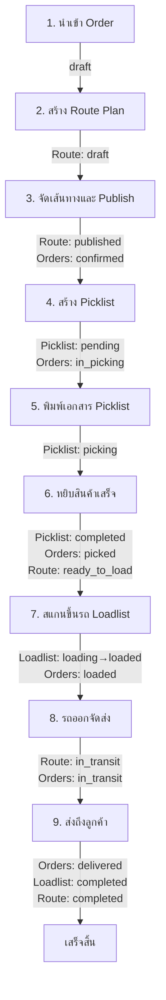

# Workflow Status Management Design Document

## 📌 Overview
เอกสารนี้อธิบาย Workflow และการเชื่อมโยงสถานะระหว่าง Orders, Route Plans, Picklists และ Loadlists ในระบบ WMS

---

## 🔄 Complete Workflow



---

## 📊 Status Flow ของแต่ละ Entity

### 1. Orders Status Flow
```
draft
  ↓ (เมื่อ Route Plan ถูก published)
confirmed
  ↓ (เมื่อ Picklist ถูกสร้าง)
in_picking
  ↓ (เมื่อ Picklist เปลี่ยนเป็น completed)
picked
  ↓ (เมื่อสแกนขึ้นรถใน Loadlist)
loaded
  ↓ (เมื่อรถออกจากคลัง)
in_transit
  ↓ (เมื่อส่งถึงลูกค้า)
delivered
```

**Status Enum:**
```sql
order_status_enum:
- draft           -- ร่าง (นำเข้าใหม่)
- confirmed       -- ยืนยันแล้ว (Route Plan published)
- in_picking      -- กำลังหยิบ (Picklist created)
- picked          -- หยิบเสร็จแล้ว (Picklist completed)
- loaded          -- ขึ้นรถแล้ว (Loadlist loaded)
- in_transit      -- กำลังจัดส่ง (รถออกแล้ว)
- delivered       -- ส่งถึงแล้ว
- cancelled       -- ยกเลิก
```

---

### 2. Route Plan Status Flow
```
draft
  ↓ (เมื่อกดปุ่ม Publish)
published
  ↓ (เมื่อ Picklists ทั้งหมด completed)
ready_to_load (สถานะใหม่)
  ↓ (เมื่อรถออกจากคลัง)
in_transit
  ↓ (เมื่อ Loadlists ทั้งหมด completed)
completed
```

**Status Enum (ต้องเพิ่ม):**
```sql
receiving_route_plan_status_enum:
- draft           -- ร่าง
- optimizing      -- กำลังคำนวณเส้นทาง
- published       -- เผยแพร่แล้ว
- ready_to_load   -- 🆕 พร้อมขึ้นรถ (Picklists เสร็จหมด)
- in_transit      -- 🆕 กำลังจัดส่ง (รถออกแล้ว)
- completed       -- เสร็จสิ้น
- cancelled       -- ยกเลิก
```

---

### 3. Picklist Status Flow
```
pending (สร้างใหม่จาก Route Plan)
  ↓ (เมื่อพิมพ์เอกสาร)
picking (ถือว่าเริ่มหยิบแล้ว)
  ↓ (เมื่อหยิบเสร็จ)
completed
```

**Status Enum:**
```sql
picklist_status_enum:
- pending         -- รอดำเนินการ
- assigned        -- มอบหมายแล้ว (ไม่ใช้แล้ว)
- picking         -- กำลังหยิบ (หลังพิมพ์เอกสาร)
- completed       -- เสร็จสิ้น
- cancelled       -- ยกเลิก
```

---

### 4. Loadlist Status Flow (ใหม่)
```
pending (สร้างใหม่)
  ↓ (เมื่อเริ่มสแกนขึ้นรถ)
loading (กำลังขึ้นรถ)
  ↓ (เมื่อขึ้นรถครบ/กดปุ่มออกจัดส่ง)
loaded (พร้อมออกจัดส่ง)
  ↓ (เมื่อทุก Order ส่งถึงแล้ว)
completed
```

**Status Enum (ต้องสร้างใหม่):**
```sql
loadlist_status_enum:
- pending         -- สร้างใหม่
- loading         -- กำลังขึ้นรถ (มีการสแกน)
- loaded          -- ขึ้นรถเสร็จ พร้อมออก
- completed       -- จัดส่งเสร็จทั้งหมด
- cancelled       -- ยกเลิก
```

---

## 🔗 Status Relationship Matrix

| ขั้นตอน | Order Status | Route Plan Status | Picklist Status | Loadlist Status | Trigger Event |
|---------|-------------|-------------------|-----------------|-----------------|---------------|
| **1. นำเข้า** | `draft` | - | - | - | Import Order |
| **2. สร้าง Route** | `draft` | `draft` | - | - | Create Route Plan |
| **3. Publish Route** | `confirmed` ✅ | `published` ✅ | - | - | Publish Route Plan |
| **4. สร้าง Picklist** | `in_picking` ✅ | `published` | `pending` ✅ | - | Create Picklist |
| **5. พิมพ์เอกสาร** | `in_picking` | `published` | `picking` ✅ | - | Print Picklist |
| **6. หยิบเสร็จ** | `picked` ✅ | `ready_to_load` ✅ | `completed` ✅ | - | Complete Picklist |
| **7. สแกนขึ้นรถ** | `loaded` ✅ | `ready_to_load` | `completed` | `pending→loading→loaded` ✅ | Scan to Loadlist |
| **8. รถออก** | `in_transit` ✅ | `in_transit` ✅ | `completed` | `loaded` | Departure |
| **9. ส่งถึง** | `delivered` ✅ | `completed` ✅ | `completed` | `completed` ✅ | Delivery Complete |

---

## 🔧 Triggers ที่ต้องสร้าง

### Trigger 1: Route Plan Publish → Update Orders
**Event:** Route Plan status เปลี่ยนเป็น `published`
**Action:** Orders ที่อยู่ใน Route Plan เปลี่ยนจาก `draft` → `confirmed`

```sql
CREATE OR REPLACE FUNCTION update_orders_on_route_publish()
RETURNS TRIGGER AS $$
BEGIN
    IF NEW.status = 'published' AND OLD.status != 'published' THEN
        -- อัปเดต Orders ที่อยู่ใน Route Plan นี้
        UPDATE wms_orders
        SET status = 'confirmed', updated_at = NOW()
        WHERE order_id IN (
            SELECT DISTINCT unnest(s.order_ids)
            FROM receiving_route_trip_stops s
            JOIN receiving_route_trips t ON s.trip_id = t.trip_id
            WHERE t.plan_id = NEW.plan_id
        ) AND status = 'draft';
    END IF;
    RETURN NEW;
END;
$$ LANGUAGE plpgsql;

CREATE TRIGGER trigger_route_publish_update_orders
AFTER UPDATE ON receiving_route_plans
FOR EACH ROW
EXECUTE FUNCTION update_orders_on_route_publish();
```

---

### Trigger 2: Picklist Created → Update Orders
**Event:** Picklist ถูกสร้าง (INSERT with status = `pending`)
**Action:** Orders ที่อยู่ใน Picklist เปลี่ยนจาก `confirmed` → `in_picking`

```sql
CREATE OR REPLACE FUNCTION update_orders_on_picklist_create()
RETURNS TRIGGER AS $$
BEGIN
    -- อัปเดต Orders ที่อยู่ใน Picklist นี้
    UPDATE wms_orders
    SET status = 'in_picking', updated_at = NOW()
    WHERE order_id IN (
        SELECT DISTINCT order_id
        FROM picklist_items
        WHERE picklist_id = NEW.id
        AND order_id IS NOT NULL
    ) AND status = 'confirmed';

    RETURN NEW;
END;
$$ LANGUAGE plpgsql;

CREATE TRIGGER trigger_picklist_create_update_orders
AFTER INSERT ON picklists
FOR EACH ROW
EXECUTE FUNCTION update_orders_on_picklist_create();
```

---

### Trigger 3: Picklist Completed → Update Orders & Route Plan
**Event:** Picklist status เปลี่ยนเป็น `completed`
**Action:**
1. Orders ที่อยู่ใน Picklist เปลี่ยนจาก `in_picking` → `picked`
2. ถ้า Picklists ทั้งหมดใน Route Plan เป็น `completed` → Route Plan เปลี่ยนเป็น `ready_to_load`

```sql
CREATE OR REPLACE FUNCTION update_orders_and_route_on_picklist_complete()
RETURNS TRIGGER AS $$
DECLARE
    v_plan_id BIGINT;
    v_all_completed BOOLEAN;
BEGIN
    IF NEW.status = 'completed' AND OLD.status != 'completed' THEN
        -- 1. อัปเดต Orders
        UPDATE wms_orders
        SET status = 'picked', updated_at = NOW()
        WHERE order_id IN (
            SELECT DISTINCT order_id
            FROM picklist_items
            WHERE picklist_id = NEW.id
            AND order_id IS NOT NULL
        ) AND status = 'in_picking';

        -- 2. ตรวจสอบ Route Plan
        v_plan_id := NEW.plan_id;

        IF v_plan_id IS NOT NULL THEN
            -- ตรวจสอบว่า Picklists ทั้งหมดใน Plan นี้เสร็จหรือยัง
            SELECT NOT EXISTS (
                SELECT 1 FROM picklists
                WHERE plan_id = v_plan_id
                AND status != 'completed'
                AND status != 'cancelled'
            ) INTO v_all_completed;

            -- ถ้าเสร็จหมดแล้ว → เปลี่ยน Route Plan เป็น ready_to_load
            IF v_all_completed THEN
                UPDATE receiving_route_plans
                SET status = 'ready_to_load', updated_at = NOW()
                WHERE plan_id = v_plan_id
                AND status = 'published';
            END IF;
        END IF;
    END IF;

    RETURN NEW;
END;
$$ LANGUAGE plpgsql;

CREATE TRIGGER trigger_picklist_complete_update_orders_and_route
AFTER UPDATE ON picklists
FOR EACH ROW
EXECUTE FUNCTION update_orders_and_route_on_picklist_complete();
```

---

### Trigger 4: Loadlist Loading → Update Orders
**Event:** Order ถูกเพิ่มเข้า Loadlist (หรือ Loadlist status = `loading`)
**Action:** Order เปลี่ยนจาก `picked` → `loaded`

```sql
-- ต้องสร้างตาราง loadlist_items ก่อน (ถ้ายังไม่มี)
-- หรืออัปเดตผ่าน API เมื่อสแกนขึ้นรถ

CREATE OR REPLACE FUNCTION update_order_on_loadlist_scan()
RETURNS TRIGGER AS $$
BEGIN
    -- เมื่อมี order_id ถูกเพิ่มเข้า loadlist_items
    UPDATE wms_orders
    SET status = 'loaded', updated_at = NOW()
    WHERE order_id = NEW.order_id
    AND status = 'picked';

    RETURN NEW;
END;
$$ LANGUAGE plpgsql;

CREATE TRIGGER trigger_loadlist_item_update_order
AFTER INSERT ON loadlist_items
FOR EACH ROW
EXECUTE FUNCTION update_order_on_loadlist_scan();
```

---

### Trigger 5: Loadlist Departure → Update Orders & Route Plan
**Event:** Loadlist status เปลี่ยนเป็น `loaded` (รถพร้อมออก)
**Action:**
1. Orders ใน Loadlist เปลี่ยนจาก `loaded` → `in_transit`
2. Route Plan เปลี่ยนจาก `ready_to_load` → `in_transit`

```sql
CREATE OR REPLACE FUNCTION update_orders_and_route_on_departure()
RETURNS TRIGGER AS $$
DECLARE
    v_plan_id BIGINT;
BEGIN
    IF NEW.status = 'loaded' AND OLD.status = 'loading' THEN
        -- 1. อัปเดต Orders
        UPDATE wms_orders
        SET status = 'in_transit', updated_at = NOW()
        WHERE order_id IN (
            SELECT order_id FROM loadlist_items
            WHERE loadlist_id = NEW.id
        ) AND status = 'loaded';

        -- 2. อัปเดต Route Plan
        v_plan_id := NEW.plan_id;

        IF v_plan_id IS NOT NULL THEN
            UPDATE receiving_route_plans
            SET status = 'in_transit', updated_at = NOW()
            WHERE plan_id = v_plan_id
            AND status = 'ready_to_load';
        END IF;
    END IF;

    RETURN NEW;
END;
$$ LANGUAGE plpgsql;

CREATE TRIGGER trigger_departure_update_orders_and_route
AFTER UPDATE ON loadlists
FOR EACH ROW
EXECUTE FUNCTION update_orders_and_route_on_departure();
```

---

### Trigger 6: Order Delivered → Update Loadlist & Route Plan
**Event:** Order status เปลี่ยนเป็น `delivered`
**Action:**
1. ตรวจสอบ Orders ทั้งหมดใน Loadlist → ถ้าทุก Order `delivered` → Loadlist เปลี่ยนเป็น `completed`
2. ตรวจสอบ Loadlists ทั้งหมดใน Route Plan → ถ้าทุก Loadlist `completed` → Route Plan เปลี่ยนเป็น `completed`

```sql
CREATE OR REPLACE FUNCTION update_loadlist_and_route_on_delivery()
RETURNS TRIGGER AS $$
DECLARE
    v_loadlist_id BIGINT;
    v_plan_id BIGINT;
    v_all_delivered BOOLEAN;
    v_all_loadlists_completed BOOLEAN;
BEGIN
    IF NEW.status = 'delivered' AND OLD.status = 'in_transit' THEN
        -- 1. หา Loadlist ที่ Order นี้อยู่
        SELECT loadlist_id INTO v_loadlist_id
        FROM loadlist_items
        WHERE order_id = NEW.order_id
        LIMIT 1;

        IF v_loadlist_id IS NOT NULL THEN
            -- ตรวจสอบว่า Orders ทั้งหมดใน Loadlist ส่งถึงหรือยัง
            SELECT NOT EXISTS (
                SELECT 1 FROM wms_orders o
                JOIN loadlist_items li ON o.order_id = li.order_id
                WHERE li.loadlist_id = v_loadlist_id
                AND o.status != 'delivered'
            ) INTO v_all_delivered;

            -- ถ้าส่งถึงหมดแล้ว → Loadlist completed
            IF v_all_delivered THEN
                UPDATE loadlists
                SET status = 'completed', updated_at = NOW()
                WHERE id = v_loadlist_id
                AND status = 'loaded'
                RETURNING plan_id INTO v_plan_id;

                -- 2. ตรวจสอบ Route Plan
                IF v_plan_id IS NOT NULL THEN
                    SELECT NOT EXISTS (
                        SELECT 1 FROM loadlists
                        WHERE plan_id = v_plan_id
                        AND status != 'completed'
                        AND status != 'cancelled'
                    ) INTO v_all_loadlists_completed;

                    -- ถ้า Loadlists ทั้งหมดเสร็จแล้ว → Route completed
                    IF v_all_loadlists_completed THEN
                        UPDATE receiving_route_plans
                        SET status = 'completed', updated_at = NOW()
                        WHERE plan_id = v_plan_id
                        AND status = 'in_transit';
                    END IF;
                END IF;
            END IF;
        END IF;
    END IF;

    RETURN NEW;
END;
$$ LANGUAGE plpgsql;

CREATE TRIGGER trigger_delivery_update_loadlist_and_route
AFTER UPDATE ON wms_orders
FOR EACH ROW
EXECUTE FUNCTION update_loadlist_and_route_on_delivery();
```

---

## 📝 API Endpoints ที่ต้องอัปเดต

### 1. Print Picklist API
**Endpoint:** `POST /api/picklists/{id}/print`
**Action:** เปลี่ยน Picklist status จาก `pending` → `picking`

```typescript
export async function POST(
  request: NextRequest,
  { params }: { params: { id: string } }
) {
  const supabase = await createClient();
  const picklistId = params.id;

  // อัปเดตสถานะเป็น picking
  const { error } = await supabase
    .from('picklists')
    .update({ status: 'picking', updated_at: new Date().toISOString() })
    .eq('id', picklistId);

  if (error) {
    return NextResponse.json({ error: error.message }, { status: 500 });
  }

  return NextResponse.json({ success: true });
}
```

---

## 🎨 UI Updates Required

### 1. Orders Page (`/receiving/orders`)
- แสดงสถานะที่ชัดเจน: draft, confirmed, in_picking, picked, loaded, in_transit, delivered
- เพิ่ม Badge สีที่แตกต่างกันสำหรับแต่ละสถานะ

### 2. Routes Page (`/receiving/routes`)
- เพิ่มสถานะ: `ready_to_load`, `in_transit`
- แสดง Badge ที่สะท้อนสถานะปัจจุบัน
- ปุ่ม "ออกจัดส่ง" (เปลี่ยน status เป็น in_transit)

### 3. Picklists Page (`/receiving/picklists`)
- ปุ่ม "พิมพ์เอกสาร" → เปลี่ยนสถานะเป็น `picking` อัตโนมัติ
- แสดงสถานะ: pending, picking, completed

### 4. Mobile Loading Page (`/mobile/loading`)
- สแกนขึ้นรถ → อัปเดต Order status เป็น `loaded`
- แสดงสถานะ Loadlist: pending, loading, loaded

---

## 🔍 Validation Rules

1. **Order ต้องมีพิกัด** ก่อนเพิ่มเข้า Route Plan
2. **Route Plan status = published** ถึงจะสร้าง Picklist ได้
3. **Picklist status = completed** ถึงจะสแกนขึ้นรถได้
4. **ไม่สามารถลบ Order** ที่มี status != draft (ต้อง rollback ก่อน)
5. **ไม่สามารถแก้ไข Route Plan** ที่ status != draft

---

## 📌 Summary

### Status Changes Triggered By:
1. **Route Publish** → Orders: `draft → confirmed`
2. **Picklist Create** → Orders: `confirmed → in_picking`
3. **Picklist Print** → Picklist: `pending → picking`
4. **Picklist Complete** → Orders: `in_picking → picked`, Route: `published → ready_to_load`
5. **Loadlist Scan** → Orders: `picked → loaded`
6. **Loadlist Departure** → Orders: `loaded → in_transit`, Route: `ready_to_load → in_transit`
7. **Order Delivered** → Loadlist: `loaded → completed`, Route: `in_transit → completed`

### New Enums Required:
- `receiving_route_plan_status_enum`: เพิ่ม `ready_to_load`, `in_transit`
- `loadlist_status_enum`: สร้างใหม่ (`pending`, `loading`, `loaded`, `completed`, `cancelled`)

### Triggers Required:
- 6 triggers สำหรับการเชื่อมโยงสถานะอัตโนมัติ

---

**Last Updated:** 2025-01-22
**Version:** 1.0
