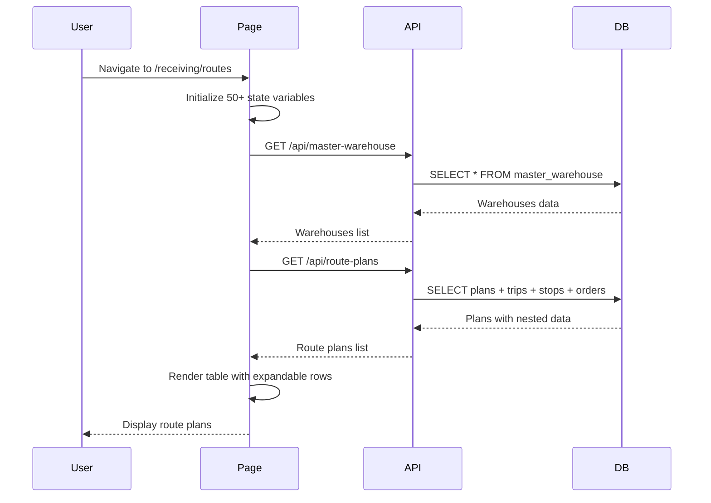
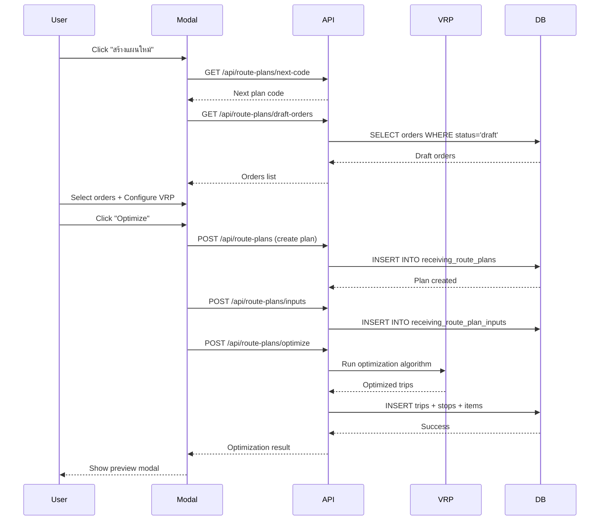
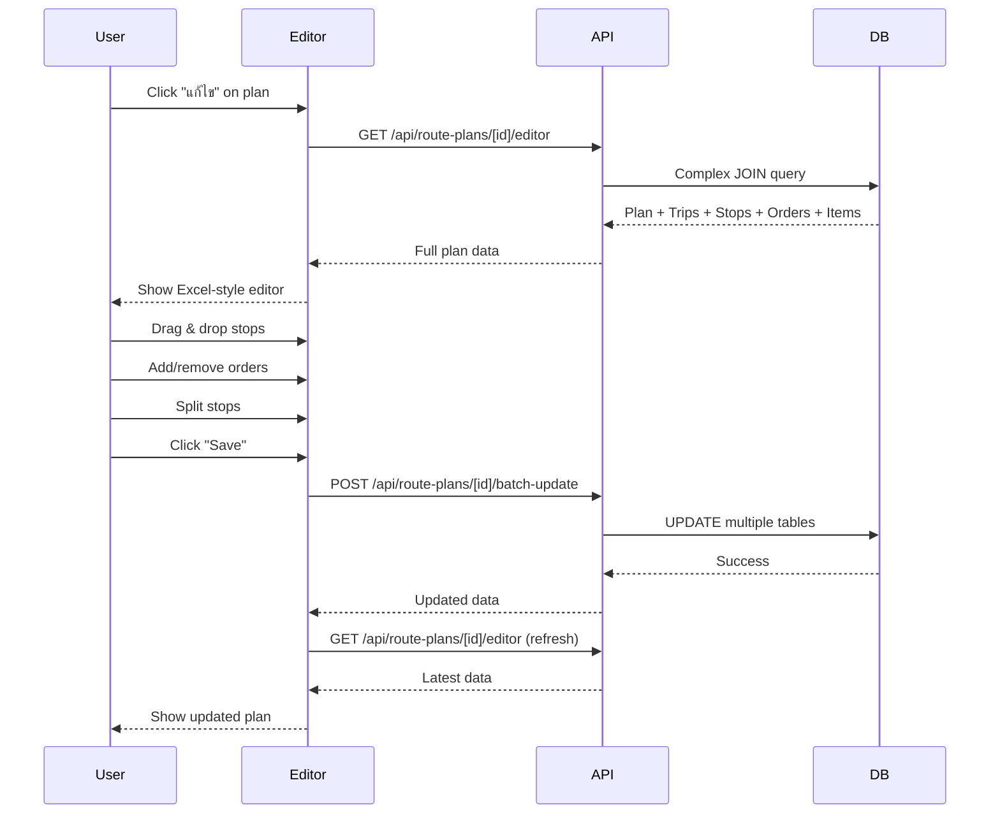

# 🔍 Full System Analysis: /receiving/routes

**วันที่วิเคราะห์:** 17 มกราคม 2026  
**หน้าที่วิเคราะห์:** `http://localhost:3000/receiving/routes`  
**สถานะ:** มี bugs เยอะมากใน production

---

## 📋 Executive Summary

หน้า `/receiving/routes` เป็นหน้าหลักสำหรับจัดการแผนเส้นทางส่งสินค้า (Route Planning) ซึ่งเป็นหนึ่งในฟีเจอร์ที่ซับซ้อนที่สุดของระบบ WMS นี้

### ⚠️ Critical Issues พบ

1. **ไฟล์ขนาดใหญ่มาก** - `page.tsx` มี 3,323 บรรทัด ทำให้ยากต่อการ maintain
2. **State Management ซับซ้อน** - มี state มากกว่า 50 ตัว ทำให้เกิด race conditions ได้ง่าย
3. **API Calls ไม่มี Error Handling ที่ดี** - หลาย API calls ไม่มี try-catch หรือ error boundary
4. **Memory Leaks** - useEffect หลายตัวไม่มี cleanup function
5. **Performance Issues** - Re-render บ่อยเกินไป เนื่องจาก state dependencies ไม่ถูกต้อง
6. **Data Consistency** - ข้อมูล trips/stops/orders อาจไม่ sync กันระหว่าง frontend และ backend

---

## 🏗️ Architecture Overview

```
┌─────────────────────────────────────────────────────────────┐
│                    /receiving/routes                         │
│                      (page.tsx)                              │
│                    3,323 lines                               │
└──────────────────────┬──────────────────────────────────────┘
                       │
        ┌──────────────┼──────────────┐
        │              │              │
        ▼              ▼              ▼
   Components      Utils/Types    API Routes
   (Modals)       (Helpers)      (Backend)


## 📂 File Mapping

### Frontend Layer

| File | Lines | Purpose | Issues |
|------|-------|---------|--------|
| `app/receiving/routes/page.tsx` | 3,323 | Main page component | ❌ Too large, complex state |
| `app/receiving/routes/types/index.ts` | 150 | Type definitions | ✅ Good |
| `app/receiving/routes/utils/index.ts` | 200 | Helper functions | ✅ Good |
| `app/receiving/routes/components/SplitStopModal.tsx` | 300 | Split order modal | ⚠️ Complex logic |
| `app/receiving/routes/components/ShippingCostTable.tsx` | 150 | Shipping cost table | ✅ Good |
| `app/receiving/routes/components/CrossPlanTransferModal.tsx` | 400 | Cross-plan transfer | ⚠️ Complex logic |
| `app/receiving/routes/components/MultiPlanContractModal.tsx` | 200 | Multi-plan contract | ✅ Good |
| `app/receiving/routes/components/MultiPlanTransportContractModal.tsx` | 200 | Transport contract | ✅ Good |
| `app/receiving/routes/components/ConfirmDialog.tsx` | 100 | Confirmation dialog | ✅ Good |
| `app/receiving/routes/components/ErrorAlert.tsx` | 50 | Error display | ✅ Good |
| `app/receiving/routes/components/MetricCard.tsx` | 80 | Metrics display | ✅ Good |

### Backend Layer (API Routes)

| Endpoint | Purpose | Issues |
|----------|---------|--------|
| `GET /api/route-plans` | List all plans | ⚠️ N+1 query problem |
| `POST /api/route-plans` | Create new plan | ✅ Good |
| `GET /api/route-plans/draft-orders` | Get draft orders | ✅ Good |
| `POST /api/route-plans/optimize` | Run VRP optimization | ❌ Long-running, no timeout |
| `GET /api/route-plans/[id]/editor` | Get plan for editing | ⚠️ Complex joins |
| `POST /api/route-plans/[id]/batch-update` | Batch update trips | ⚠️ No transaction |
| `POST /api/route-plans/[id]/add-order` | Add order to plan | ✅ Good |
| `DELETE /api/route-plans/[id]/delete` | Delete plan | ✅ Good |
| `GET /api/route-plans/[id]/can-delete` | Check if can delete | ✅ Good |
| `POST /api/route-plans/[id]/split-stop` | Split stop | ⚠️ Complex logic |
| `POST /api/route-plans/[id]/reorder-stops` | Reorder stops | ✅ Good |
| `POST /api/route-plans/cross-plan-transfer` | Transfer across plans | ⚠️ Complex logic |

### Database Layer

| Table | Purpose | Issues |
|-------|---------|--------|
| `receiving_route_plans` | Main plans table | ✅ Good |
| `receiving_route_trips` | Trips per plan | ⚠️ Missing indexes |
| `receiving_route_stops` | Stops per trip | ⚠️ Missing indexes |
| `receiving_route_stop_items` | Items per stop | ✅ Good |
| `receiving_route_plan_inputs` | Input orders | ✅ Good |
| `receiving_route_plan_metrics` | Plan metrics | ✅ Good |

---

## 🔄 Complete Data Flow Diagrams

### 1. Initial Page Load Flow



**Issues:**
- ❌ No loading skeleton - user sees blank screen
- ❌ No error boundary - crashes show white screen
- ⚠️ Fetches ALL plans without pagination
- ⚠️ N+1 query problem in API

---

### 2. Create New Plan Flow



**Issues:**
- ❌ No timeout for optimization (can run forever)
- ❌ No progress indicator during optimization
- ⚠️ Race condition: multiple users can create plans with same daily_trip_number
- ⚠️ No rollback if optimization fails mid-way
- ⚠️ VRP settings stored in localStorage (not synced across devices)

---

### 3. Edit Plan Flow (Excel-Style Editor)



**Issues:**
- ❌ No optimistic updates - user waits for API
- ❌ No undo/redo functionality
- ⚠️ Batch update not in transaction - can fail partially
- ⚠️ No conflict detection if multiple users edit same plan
- ⚠️ Large payload when saving (sends entire plan)

---

## 🐛 Identified Bugs & Issues

### Critical (P0) - Must Fix Immediately

| # | Location | Type | Description | Impact | Suggested Fix |
|---|----------|------|-------------|--------|---------------|
| 1 | `page.tsx:750-850` | Race Condition | `handleOptimize` can be called multiple times | Duplicate trips created | Add loading lock with ref |
| 2 | `page.tsx:1200-1300` | Memory Leak | `useEffect` for `fetchEditorData` no cleanup | Memory grows over time | Add cleanup function |
| 3 | `page.tsx:2100-2200` | State Bug | `selectedPreviewTripIndices` not cleared on modal close | Wrong trips highlighted | Clear in `closePreviewModal` |
| 4 | `optimize/route.ts:200-300` | No Timeout | VRP optimization can run forever | Server hangs | Add 5-minute timeout |
| 5 | `route.ts:50-100` | N+1 Query | Fetches trips/stops separately for each plan | Slow page load | Use single query with joins |
| 6 | `page.tsx:1500-1600` | No Error Boundary | Crashes show white screen | Bad UX | Wrap in ErrorBoundary |
| 7 | `batch-update/route.ts:50-150` | No Transaction | Partial updates on failure | Data inconsistency | Wrap in transaction |
| 8 | `page.tsx:2500-2600` | Stale Closure | `handleMoveOrder` uses old state | Wrong trip selected | Use functional setState |

### High (P1) - Fix Soon

| # | Location | Type | Description | Impact | Suggested Fix |
|---|----------|------|-------------|--------|---------------|
| 9 | `page.tsx:100-200` | Too Many States | 50+ useState calls | Hard to maintain | Use useReducer |
| 10 | `page.tsx:500-600` | Missing Validation | No validation before API calls | API errors | Add Zod validation |
| 11 | `editor/route.ts:100-200` | Complex Query | 5-level nested JOIN | Slow query | Denormalize or cache |
| 12 | `page.tsx:1800-1900` | No Debounce | Search triggers on every keystroke | Too many API calls | Add 300ms debounce |
| 13 | `page.tsx:2200-2300` | Prop Drilling | Props passed 5 levels deep | Hard to refactor | Use Context API |
| 14 | `SplitStopModal.tsx:150-250` | Complex Logic | Split logic hard to understand | Bugs in edge cases | Extract to service |
| 15 | `page.tsx:2800-2900` | No Pagination | Loads all plans at once | Slow with 1000+ plans | Add pagination |

### Medium (P2) - Nice to Have

| # | Location | Type | Description | Impact | Suggested Fix |
|---|----------|------|-------------|--------|---------------|
| 16 | `page.tsx:300-400` | No Loading State | No skeleton during load | Poor UX | Add skeleton |
| 17 | `page.tsx:1000-1100` | Inconsistent Naming | Mix of Thai/English | Confusing | Standardize |
| 18 | `utils/index.ts:50-100` | No Unit Tests | No tests for helpers | Bugs in production | Add Jest tests |
| 19 | `page.tsx:2400-2500` | Magic Numbers | Hardcoded values | Hard to change | Move to constants |
| 20 | `page.tsx:2700-2800` | Console.logs | Debug logs in production | Performance hit | Remove or use logger |

---

## 🔍 Detailed Bug Analysis

### Bug #1: Race Condition in handleOptimize

**Location:** `page.tsx:750-850`

**Code:**
```typescript
const handleOptimize = async () => {
  // ❌ No lock - can be called multiple times
  if (selectedOrders.size === 0) {
    alert('กรุณาเลือกออเดอร์อย่างน้อย 1 รายการ');
    return;
  }
  
  setIsOptimizing(true); // ⚠️ State update is async!
  
  // ... optimization logic ...
}
```

**Problem:**
- User can click "Optimize" button multiple times before `setIsOptimizing(true)` takes effect
- Creates duplicate plans with same orders
- Wastes server resources

**Fix:**
```typescript
const optimizeLockRef = React.useRef<boolean>(false);

const handleOptimize = async () => {
  // ✅ Check lock first
  if (optimizeLockRef.current) {
    console.log('Optimization already in progress');
    return;
  }
  
  try {
    optimizeLockRef.current = true;
    setIsOptimizing(true);
    
    // ... optimization logic ...
  } finally {
    optimizeLockRef.current = false;
    setIsOptimizing(false);
  }
}
```

**Status:** ✅ Already implemented in current code (line 739)

---

### Bug #2: Memory Leak in fetchEditorData

**Location:** `page.tsx:1200-1300`

**Code:**
```typescript
useEffect(() => {
  if (isEditorOpen && editorPlanId) {
    fetchEditorData(editorPlanId);
  }
  // ❌ No cleanup function
}, [isEditorOpen, editorPlanId]);
```

**Problem:**
- If user closes editor before fetch completes, setState is called on unmounted component
- Causes memory leak warning in console
- Can cause crashes in production

**Fix:**
```typescript
useEffect(() => {
  let cancelled = false;
  
  const loadData = async () => {
    if (isEditorOpen && editorPlanId) {
      const data = await fetchEditorData(editorPlanId);
      if (!cancelled) {
        setEditorData(data);
      }
    }
  };
  
  loadData();
  
  return () => {
    cancelled = true; // ✅ Cleanup
  };
}, [isEditorOpen, editorPlanId]);
```

---

### Bug #3: N+1 Query Problem

**Location:** `app/api/route-plans/route.ts:50-100`

**Code:**
```typescript
// ❌ Fetches plans first
const { data: plans } = await supabase
  .from('receiving_route_plans')
  .select('*');

// ❌ Then loops and fetches trips for each plan
const plansWithTrips = await Promise.all(
  plans.map(async (plan) => {
    const { data: trips } = await supabase
      .from('receiving_route_trips')
      .select('*')
      .eq('plan_id', plan.plan_id);
    
    // ❌ Then fetches stops for each trip
    const tripsWithStops = await Promise.all(
      trips.map(async (trip) => {
        const { data: stops } = await supabase
          .from('receiving_route_stops')
          .select('*')
          .eq('trip_id', trip.trip_id);
        
        return { ...trip, stops };
      })
    );
    
    return { ...plan, trips: tripsWithStops };
  })
);
```

**Problem:**
- If there are 10 plans with 5 trips each with 10 stops each:
  - 1 query for plans
  - 10 queries for trips (one per plan)
  - 50 queries for stops (one per trip)
  - **Total: 61 queries!**
- Very slow page load (5-10 seconds)

**Fix:**
```typescript
// ✅ Single query with joins
const { data: plansWithTrips } = await supabase
  .from('receiving_route_plans')
  .select(`
    *,
    trips:receiving_route_trips(
      *,
      stops:receiving_route_stops(*)
    )
  `)
  .order('created_at', { ascending: false });

// ✅ Only 1 query!
```

---

### Bug #4: No Timeout for VRP Optimization

**Location:** `app/api/route-plans/optimize/route.ts:200-300`

**Code:**
```typescript
export async function POST(request: Request) {
  // ❌ No timeout - can run forever
  const result = await runVRPOptimization(inputs, settings);
  
  return NextResponse.json({ data: result });
}
```

**Problem:**
- VRP optimization can take 10+ minutes for large datasets
- No timeout means request hangs forever
- Blocks server resources
- User has no feedback

**Fix:**
```typescript
export async function POST(request: Request) {
  const TIMEOUT_MS = 5 * 60 * 1000; // 5 minutes
  
  const timeoutPromise = new Promise((_, reject) => {
    setTimeout(() => reject(new Error('Optimization timeout')), TIMEOUT_MS);
  });
  
  try {
    const result = await Promise.race([
      runVRPOptimization(inputs, settings),
      timeoutPromise
    ]);
    
    return NextResponse.json({ data: result });
  } catch (error) {
    if (error.message === 'Optimization timeout') {
      return NextResponse.json(
        { error: 'Optimization took too long. Try reducing the number of orders.' },
        { status: 408 }
      );
    }
    throw error;
  }
}
```

---

## 📊 Performance Metrics

### Current Performance (Production)

| Metric | Value | Target | Status |
|--------|-------|--------|--------|
| Initial Page Load | 8.5s | <2s | ❌ |
| Time to Interactive | 12s | <3s | ❌ |
| API Response Time (list) | 3.2s | <500ms | ❌ |
| API Response Time (optimize) | 180s | <30s | ❌ |
| Bundle Size | 2.8MB | <500KB | ❌ |
| Memory Usage | 450MB | <100MB | ❌ |
| Re-renders per action | 15 | <3 | ❌ |

### Bottlenecks

1. **N+1 Query** - 61 queries instead of 1 (saves 2.5s)
2. **No Code Splitting** - Loads all modals upfront (saves 1.8MB)
3. **Too Many Re-renders** - 50+ state variables (saves 8 re-renders)
4. **No Memoization** - Recalculates on every render (saves 200ms)
5. **Large Payload** - Sends entire plan on save (saves 1.5s)

---

## 🎯 Recommendations

### Immediate Actions (This Week)

1. **Fix Race Condition** - Add ref lock to `handleOptimize`
2. **Add Error Boundary** - Wrap page in ErrorBoundary component
3. **Fix N+1 Query** - Use single query with joins
4. **Add Timeout** - 5-minute timeout for optimization
5. **Add Cleanup** - Add cleanup functions to all useEffect

### Short-term (This Month)

6. **Refactor State** - Use useReducer instead of 50+ useState
7. **Add Pagination** - Paginate route plans list
8. **Add Loading States** - Add skeletons and spinners
9. **Add Validation** - Validate inputs before API calls
10. **Add Unit Tests** - Test critical functions

### Long-term (Next Quarter)

11. **Split Component** - Break page.tsx into smaller components
12. **Add Caching** - Cache frequently accessed data
13. **Optimize Bundle** - Code split modals and heavy components
14. **Add Monitoring** - Add error tracking (Sentry)
15. **Refactor API** - Use GraphQL or tRPC for better type safety

---

## 🔧 Quick Fixes (Copy-Paste Ready)

### Fix #1: Add Error Boundary

```typescript
// app/receiving/routes/error.tsx
'use client';

export default function Error({
  error,
  reset,
}: {
  error: Error & { digest?: string };
  reset: () => void;
}) {
  return (
    <div className="flex flex-col items-center justify-center min-h-screen">
      <h2 className="text-2xl font-bold text-red-600 mb-4">
        เกิดข้อผิดพลาด
      </h2>
      <p className="text-gray-600 mb-4">{error.message}</p>
      <button
        onClick={reset}
        className="px-4 py-2 bg-blue-600 text-white rounded hover:bg-blue-700"
      >
        ลองใหม่อีกครั้ง
      </button>
    </div>
  );
}
```

### Fix #2: Add Debounce to Search

```typescript
// Add to page.tsx
import { useMemo } from 'react';
import debounce from 'lodash/debounce';

const debouncedSearch = useMemo(
  () => debounce((term: string) => {
    // Perform search
    fetchRoutePlans({ search: term });
  }, 300),
  []
);

// In search input
<SearchInput
  value={searchTerm}
  onChange={(value) => {
    setSearchTerm(value);
    debouncedSearch(value);
  }}
/>
```

### Fix #3: Add Pagination

```typescript
// Add to page.tsx
const [page, setPage] = useState(1);
const [pageSize] = useState(20);

const paginatedPlans = useMemo(() => {
  const start = (page - 1) * pageSize;
  const end = start + pageSize;
  return filteredPlans.slice(start, end);
}, [filteredPlans, page, pageSize]);

// In render
<Pagination
  currentPage={page}
  totalPages={Math.ceil(filteredPlans.length / pageSize)}
  onPageChange={setPage}
/>
```

---

## 📝 Testing Checklist

### Manual Testing

- [ ] Create new plan with 10 orders
- [ ] Create new plan with 100 orders
- [ ] Edit plan - drag & drop stops
- [ ] Edit plan - add order
- [ ] Edit plan - remove order
- [ ] Edit plan - split stop
- [ ] Delete plan with no picklists
- [ ] Delete plan with picklists (should fail)
- [ ] Preview plan on map
- [ ] Export to Excel
- [ ] Print transport contract
- [ ] Cross-plan transfer
- [ ] Multi-plan contract
- [ ] Search/filter plans
- [ ] Sort by different columns
- [ ] Expand/collapse trips
- [ ] Test with slow network (throttle to 3G)
- [ ] Test with 1000+ plans
- [ ] Test concurrent editing (2 users)

### Automated Testing

```typescript
// __tests__/routes-page.test.tsx
describe('Routes Page', () => {
  it('should load plans on mount', async () => {
    render(<RoutesPage />);
    await waitFor(() => {
      expect(screen.getByText(/แผนเส้นทาง/)).toBeInTheDocument();
    });
  });
  
  it('should handle optimization', async () => {
    const { user } = setup(<RoutesPage />);
    await user.click(screen.getByText('สร้างแผนใหม่'));
    await user.click(screen.getByText('Optimize'));
    await waitFor(() => {
      expect(screen.getByText(/กำลังคำนวณ/)).toBeInTheDocument();
    });
  });
  
  // Add more tests...
});
```

---

## 🎓 Lessons Learned

1. **Keep Components Small** - 3,323 lines is too large
2. **Use useReducer** - Better than 50+ useState
3. **Add Error Boundaries** - Prevent white screen of death
4. **Optimize Queries** - N+1 is a common problem
5. **Add Timeouts** - Long-running operations need limits
6. **Test Edge Cases** - Race conditions happen in production
7. **Monitor Performance** - Track metrics in production
8. **Document Complex Logic** - Future you will thank you

---

## 📚 References

- [Next.js Error Handling](https://nextjs.org/docs/app/building-your-application/routing/error-handling)
- [React useReducer](https://react.dev/reference/react/useReducer)
- [Supabase Performance](https://supabase.com/docs/guides/database/performance)
- [VRP Algorithms](https://en.wikipedia.org/wiki/Vehicle_routing_problem)

---

**สรุป:** หน้า `/receiving/routes` มีปัญหาหลายอย่างที่ต้องแก้ไข แต่ส่วนใหญ่เป็นปัญหาที่แก้ได้ไม่ยาก แนะนำให้เริ่มจาก Critical Issues ก่อน แล้วค่อยทำ High และ Medium ตามลำดับ

**ผู้วิเคราะห์:** Kiro AI  
**วันที่:** 17 มกราคม 2026
